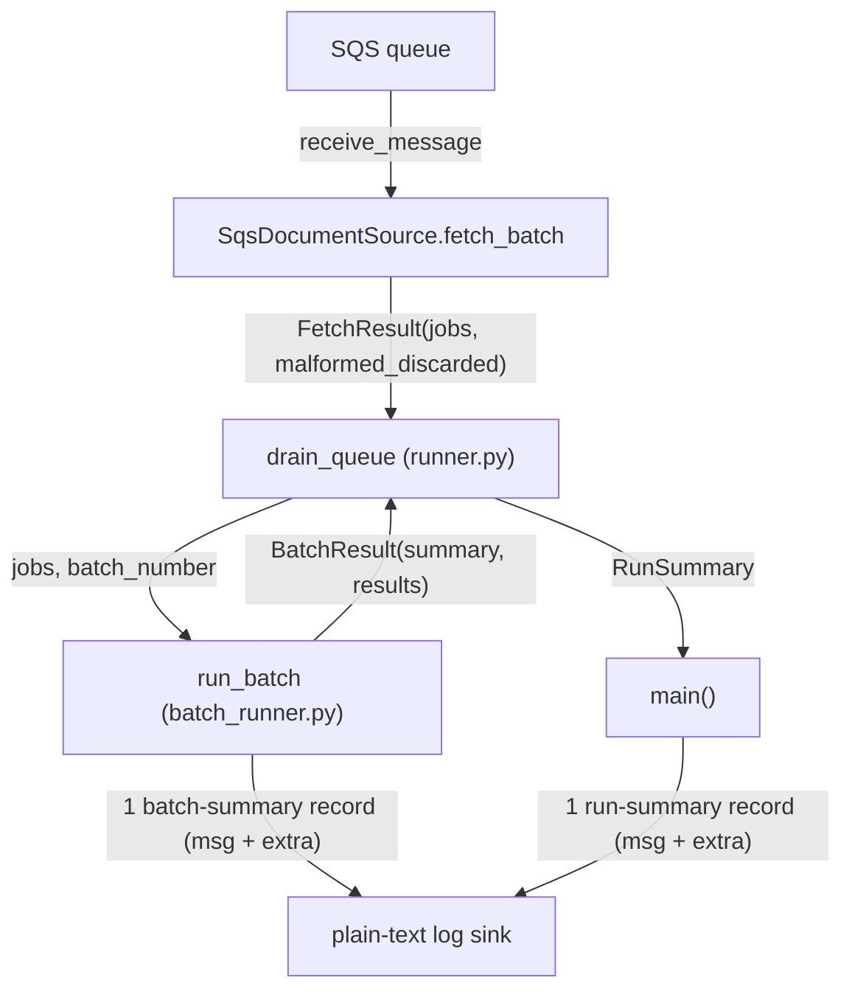

# Design Document

## Overview

This feature makes malformed-message discards visible in the run summary and introduces two-tier structured reporting (per-batch and per-run). The motivating bug: a run that receives only malformed messages reports `0 batch(es), 0 message(s), 0 succeeded, 0 failed; terminal_reason=queue drained.` — every count zero — because `SqsDocumentSource.fetch_batch` deletes malformed messages and returns only the surviving jobs, so the discard never reaches the counters.

The fix threads a discard count through three structured values, all frozen so a returned summary cannot be mutated before it is logged:

- **`FetchResult`** (`document_source.py`): `jobs: list[DocumentJob]` + `malformed_discarded: int`, returned by every `fetch_batch` path.
- **`BatchResult`** (beside `DocumentResult`): `summary: BatchSummary` + `results: list[DocumentResult]`, returned by `run_batch`, which also emits exactly one structured batch-summary record replacing the legacy `"Batch complete..."` line.
- **`RunSummary`** (`runner.py`): gains `messages_discarded` and `jobs_processed`, so `drain_queue` can guarantee the conservation invariant `messages_received == jobs_processed + messages_discarded` by construction.

The plain-text log formatter is retained. Both summaries render their counts into the human-readable message string **and** attach the same counts via the logging `extra` mechanism (`_Requirements: 3.2, 3.3, 7.2, 7.3_`). Discard and acknowledgement behaviour are unchanged — malformed messages are still deleted (never DLQ'd); only their visibility is added.

_Satisfies: Requirements 1, 2, 3, 4, 5, 6, 7, 8, 9_

## Architecture

The change is confined to the orchestration seam. Data flows one way: `SqsDocumentSource.fetch_batch` → `FetchResult` → `drain_queue` → (`run_batch` → `BatchResult`) → `RunSummary` → `main` log record.



Termination semantics are unchanged: the drain loop stops on the first empty long-poll (`"queue drained"`) or when `MAX_BATCHES_PER_RUN` batches have started (`"hit max-batches ceiling"`). The only structural change to the loop is that the terminating empty poll's `malformed_discarded` is now accounted **before** the loop breaks, so a poll that returns no jobs but discarded malformed messages still contributes to `messages_received` and `messages_discarded`.

### Model placement decision

- **`FetchResult`** lives in `document_source.py` next to `DocumentJob`, and is a **frozen pydantic `BaseModel`** with `model_config = ConfigDict(frozen=True)`. Justification: it is the return type of the `DocumentSource` Protocol declared in that module, it composes `DocumentJob` (also a frozen pydantic model there), and pydantic gives field validation for free. This matches the existing style of the module.
- **`BatchSummary`** and **`BatchResult`** live in `batch_processing/document_result.py`, beside `DocumentResult`, and are **`@dataclass(frozen=True)`**. Justification: `DocumentResult` is a plain `@dataclass`; `BatchResult` composes a `list[DocumentResult]`, so keeping all three as dataclasses in one model module is the most locally consistent choice and avoids mixing pydantic models with dataclasses in the same composite. (`RunSummary` remains a frozen pydantic model in `runner.py`, unchanged in kind — the two model families are deliberately kept to their existing homes.)

## Components and Interfaces

### 1. `FetchResult` and `DocumentSource` / `SqsDocumentSource` (`document_source.py`)

**New model** (placed after `DocumentJob`):

```python
class FetchResult(BaseModel):
    """The outcome of a single poll: the valid jobs plus the malformed discard count.

    Frozen so a returned poll result cannot be mutated before the drainer accounts
    for it. ``malformed_discarded`` is the number of messages this poll deleted as
    malformed (received messages minus valid jobs); an empty or transient poll
    carries ``malformed_discarded == 0``.
    """

    model_config = ConfigDict(frozen=True)

    jobs: list[DocumentJob] = Field(default_factory=list)
    malformed_discarded: int = Field(default=0, ge=0)
```

**Protocol change** — declare the new return type (`_Requirements: 1.3_`):

```python
class DocumentSource(Protocol):
    def fetch_batch(self) -> FetchResult:
        """Return the next poll's valid jobs and malformed-discard count."""
        ...

    def acknowledge(self, job: DocumentJob) -> None:
        ...
```

**`SqsDocumentSource.fetch_batch` change** — three edit points; behaviour otherwise unchanged.

- **Signature/return annotation**: `def fetch_batch(self) -> FetchResult:`.
- **Transient-error early return** (currently `return []`) becomes:

  ```python
  if _is_transient_receive_error(exc):
      logger.warning(
          "Transient error receiving messages from queue '%s'; treating as empty poll: %s",
          self.queue_name, exc,
      )
      return FetchResult(jobs=[], malformed_discarded=0)  # (Req 1.6)
  ```

- **Normal return** — the count of discards is exactly `len(messages) - len(jobs)`, which the existing summary log line already computes implicitly. Compute it explicitly and return a `FetchResult`:

  ```python
  malformed_discarded = len(messages) - len(jobs)
  logger.info(
      "SqsDocumentSource received %d message(s); %d valid job(s) after filtering malformed.",
      len(messages), len(jobs),
  )
  return FetchResult(jobs=jobs, malformed_discarded=malformed_discarded)  # (Req 1.4, 1.5)
  ```

  An empty receive (`messages == []`) naturally yields `FetchResult(jobs=[], malformed_discarded=0)` (`_Requirements: 1.6_`); an all-malformed poll yields `jobs=[]` with `malformed_discarded > 0` (`_Requirements: 1.5_`).

The malformed-delete path (`self._delete_message(...)`) is untouched: malformed messages are still deleted and never routed to the DLQ (`_Requirements: 9.1_`).

### 2. `BatchSummary` and `BatchResult` (`batch_processing/document_result.py`)

**New models** (placed after `DocumentResult`):

```python
@dataclass(frozen=True)
class BatchSummary:
    """Per-batch aggregate counts for one run_batch invocation.

    ``jobs_in_batch`` is the number of jobs received into the batch (``len(jobs)``),
    not the number of owners; ``duplicates_collapsed`` is how many of those jobs
    were folded onto an earlier owner sharing the same source_doc_id. There is no
    ``messages_discarded`` field: discards are a source/run concern, not a batch one.
    """

    batch_number: int
    jobs_in_batch: int
    succeeded: int
    failed: int
    duplicates_collapsed: int


@dataclass(frozen=True)
class BatchResult:
    """A batch outcome: its summary plus one DocumentResult per processed owner."""

    summary: BatchSummary
    results: list[DocumentResult]
```

`BatchSummary` exposes exactly the five fields and no `messages_discarded` (`_Requirements: 2.4_`); both types are frozen (`_Requirements: 2.3_`).

### 3. `run_batch` (`batch_runner.py`)

**Signature change** (`_Requirements: 2.1, 2.2_`):

```python
def run_batch(
    jobs: list[DocumentJob], pipeline: Pipeline, source: DocumentSource, batch_number: int
) -> BatchResult:
```

All existing internals are preserved verbatim: owner/`duplicates_by_id` collapsing, the per-duplicate WARNING, `max_workers = min(settings.MAX_CONCURRENT_DOCUMENTS, len(owners))`, the `ThreadPoolExecutor`, and the acknowledge-owner-and-duplicates-on-success logic (`_Requirements: 2.9, 9.2, 9.3_`).

**Empty-batch early return** now returns a well-formed `BatchResult`:

```python
if not jobs:
    logger.info("No documents to process in this batch.")
    return BatchResult(
        summary=BatchSummary(
            batch_number=batch_number, jobs_in_batch=0,
            succeeded=0, failed=0, duplicates_collapsed=0,
        ),
        results=[],
    )
```

(In practice `drain_queue` only calls `run_batch` with non-empty `jobs`, but the guard stays total.)

**Count derivation** (after the executor block, replacing the legacy `succeeded/failed`/`"Batch complete"` lines):

```python
succeeded = sum(1 for r in results if r.success)
failed = len(results) - succeeded
duplicates_collapsed = sum(len(dups) for dups in duplicates_by_id.values())  # (Req 2.8)
summary = BatchSummary(
    batch_number=batch_number,
    jobs_in_batch=len(jobs),          # jobs RECEIVED into the batch, not len(owners) (Req 2.6)
    succeeded=succeeded,              # (Req 2.7)
    failed=failed,                    # (Req 2.7)
    duplicates_collapsed=duplicates_collapsed,
)
logger.info(
    "Batch %d summary: %d job(s) in batch, %d succeeded, %d failed, %d duplicate(s) collapsed.",
    summary.batch_number, summary.jobs_in_batch, summary.succeeded, summary.failed,
    summary.duplicates_collapsed,
    extra={
        "batch_number": summary.batch_number,
        "jobs_in_batch": summary.jobs_in_batch,
        "succeeded": summary.succeeded,
        "failed": summary.failed,
        "duplicates_collapsed": summary.duplicates_collapsed,
    },
)  # (Req 3.1, 3.2, 3.3)
return BatchResult(summary=summary, results=results)
```

`jobs_in_batch = len(jobs)` (the jobs received), **not** `len(owners)`: Requirement 2.6 says "the number of jobs received into the batch", so a batch of 3 jobs collapsing to 1 owner reports `jobs_in_batch=3, succeeded+failed=1, duplicates_collapsed=2`. The legacy `logger.info("Batch complete: ...")` line is removed entirely; the batch-summary record is the only per-batch record (`_Requirements: 3.4_`).

### 4. `drain_queue` (`runner.py`)

Owns 1-based batch sequencing and aggregates fetch + batch results. Revised loop:

```python
def drain_queue(source: DocumentSource, pipeline: Pipeline) -> RunSummary:
    batches_processed = 0
    messages_received = 0
    messages_discarded = 0
    jobs_processed = 0
    successes = 0
    failures = 0
    terminal_reason = "queue drained"

    while batches_processed < settings.MAX_BATCHES_PER_RUN:
        fetch_result = source.fetch_batch()
        jobs = fetch_result.jobs
        malformed_discarded = fetch_result.malformed_discarded

        # Account EVERY poll, including the terminating empty poll, BEFORE any break,
        # so a poll that only discarded malformed messages is still counted. The
        # invariant messages_received == jobs_processed + messages_discarded holds by
        # construction: each poll adds len(jobs)+malformed_discarded to received,
        # len(jobs) to jobs_processed, and malformed_discarded to discarded.
        messages_received += len(jobs) + malformed_discarded  # (Req 5.2)
        messages_discarded += malformed_discarded              # (Req 5.3)
        jobs_processed += len(jobs)                            # (Req 5.4)

        if not jobs:
            terminal_reason = "queue drained"                 # (Req 5.7)
            break

        # 1-based batch_number in start order (Req 4.1).
        batches_processed += 1                                 # (Req 5.6)
        batch_result = run_batch(jobs, pipeline, source, batch_number=batches_processed)

        results = batch_result.results                         # (Req 4.3)
        successes += sum(1 for r in results if r.success)      # (Req 5.5)
        failures += sum(1 for r in results if not r.success)   # (Req 5.5)
    else:
        terminal_reason = "hit max-batches ceiling"            # (Req 5.8)
        logger.warning(
            "Reached MAX_BATCHES_PER_RUN ceiling (%d batches); stopping this run. "
            "Remaining work is left in the queue for the next run.",
            settings.MAX_BATCHES_PER_RUN,
        )

    return RunSummary(
        batches_processed=batches_processed,
        messages_received=messages_received,
        messages_discarded=messages_discarded,
        jobs_processed=jobs_processed,
        successes=successes,
        failures=failures,
        terminal_reason=terminal_reason,
    )
```

Key points:
- The terminating-empty-poll accounting happens **before** `break`, so a drained poll with `malformed_discarded > 0` still lifts `messages_received` and `messages_discarded` off zero — this is exactly what fixes the motivating bug (`_Requirements: 5.2, 5.3, 8.1, 8.2_`).
- `batch_number` starts at 1 (`batches_processed` is incremented before the `run_batch` call) and increments per started batch (`_Requirements: 4.1_`).
- `drain_queue` never calls `source.acknowledge`; acknowledgement stays delegated to `run_batch`/`source` (`_Requirements: 4.4_`).
- The invariant `messages_received == jobs_processed + messages_discarded` holds after every poll because each poll increments the three counters together (`_Requirements: 6.1_`).

### 5. `RunSummary` and `main()` (`runner.py`)

**Field change** — add `messages_discarded` and `jobs_processed` (`_Requirements: 5.1_`):

```python
class RunSummary(BaseModel):
    model_config = ConfigDict(frozen=True)

    batches_processed: int
    messages_received: int
    messages_discarded: int
    jobs_processed: int
    successes: int
    failures: int
    terminal_reason: str
```

The docstring `Attributes:` block is updated to document all seven fields (and to correct the stale `messages_received` description, which currently says "Sum of `len(jobs)`"; it is now valid jobs plus malformed discards).

**`main()` summary log** — render all seven fields into the message and attach the same via `extra` (`_Requirements: 7.1, 7.2, 7.3_`):

```python
logger.info(
    "Pipeline run summary: %d batch(es), %d message(s) received, %d discarded, "
    "%d job(s) processed, %d succeeded, %d failed; terminal_reason=%s.",
    summary.batches_processed,
    summary.messages_received,
    summary.messages_discarded,
    summary.jobs_processed,
    summary.successes,
    summary.failures,
    summary.terminal_reason,
    extra={
        "batches_processed": summary.batches_processed,
        "messages_received": summary.messages_received,
        "messages_discarded": summary.messages_discarded,
        "jobs_processed": summary.jobs_processed,
        "successes": summary.successes,
        "failures": summary.failures,
        "terminal_reason": summary.terminal_reason,
    },
)
```

The message prefix `"Pipeline run summary"` is retained so existing record-selection assertions keep working.

## Data Models

| Model | Location | Kind | Fields |
|-------|----------|------|--------|
| `FetchResult` | `document_source.py` | frozen pydantic `BaseModel` | `jobs: list[DocumentJob]`, `malformed_discarded: int` |
| `BatchSummary` | `batch_processing/document_result.py` | `@dataclass(frozen=True)` | `batch_number`, `jobs_in_batch`, `succeeded`, `failed`, `duplicates_collapsed` (all `int`) |
| `BatchResult` | `batch_processing/document_result.py` | `@dataclass(frozen=True)` | `summary: BatchSummary`, `results: list[DocumentResult]` |
| `RunSummary` | `runner.py` | frozen pydantic `BaseModel` | `batches_processed`, `messages_received`, `messages_discarded`, `jobs_processed`, `successes`, `failures` (all `int`), `terminal_reason: str` |

`DocumentJob` and `DocumentResult` are unchanged.

## Error Handling

No new error paths. Existing behaviour is preserved exactly:

- **Transient receive error** → logged WARNING, returns `FetchResult(jobs=[], malformed_discarded=0)` (treated as an empty poll for retry).
- **Permanent/unknown receive error** → logged CRITICAL and re-raised, failing the run.
- **Malformed message** → logged ERROR, deleted (never DLQ'd), counted in `malformed_discarded`.
- **Per-document processing failure** → contained in `process_document_job`, recorded as `DocumentResult(success=False, ...)`, owner and duplicates left unacknowledged for SQS redrive.
- **Ceiling reached** → single WARNING from `drain_queue`, returns normally with `terminal_reason="hit max-batches ceiling"`.

## Touch Points and Test Impact

Every edited symbol and its test impact:

**`src/ingestion_pipeline/orchestration/document_source.py`**
- Add `FetchResult`; change `DocumentSource.fetch_batch` return annotation to `FetchResult`; change `SqsDocumentSource.fetch_batch` return annotation and both return paths (normal + transient early-return).
- Tests: `tests/orchestration/test_document_source.py` — `test_fetch_batch_returns_jobs_for_valid_messages`, `test_fetch_batch_deletes_malformed_and_continues`, and `test_fetch_batch_and_acknowledge_end_to_end_with_moto` must read `result.jobs` instead of treating the return as a list; `test_fetch_batch_empty_receive_returns_empty_list` and the two `test_fetch_batch_transient_receive_error_returns_empty_list` cases must assert `FetchResult(jobs=[], malformed_discarded=0)` (rename intent: "returns empty result"); add a new test asserting `malformed_discarded == 1` for the mixed valid+malformed poll and `>=1` for an all-malformed poll. `test_fetch_batch_permanent_receive_error_propagates` is unaffected (still raises).

**`src/ingestion_pipeline/orchestration/batch_processing/document_result.py`**
- Add `BatchSummary` and `BatchResult` dataclasses.
- Tests: `tests/orchestration/batch_processing/test_document_result.py` — add frozen/field-set assertions for both new models.

**`src/ingestion_pipeline/orchestration/batch_processing/batch_runner.py`**
- `run_batch` gains `batch_number: int`, returns `BatchResult`, replaces the legacy `"Batch complete"` line with the structured batch-summary record; empty-batch guard returns a `BatchResult`.
- Tests: `tests/orchestration/batch_processing/test_batch_runner.py` — every `run_batch(...)` call site must pass `batch_number` and consume `BatchResult` (`.results` for the existing assertions, `.summary` for new count assertions). Affected: `test_run_batch_empty_returns_no_results`, `test_run_batch_processes_all_and_acknowledges_only_successes`, `test_run_batch_caps_workers_at_max_concurrent_documents`, `test_run_batch_caps_workers_at_job_count_when_fewer_jobs`, `test_run_batch_executes_documents_concurrently`, `test_run_batch_does_not_acknowledge_pipeline_failure`, the duplicate-key exploration tests (`test_explore_*`, `test_explore_property_duplicate_key_repeated_n_times`), and the preservation property tests (`test_preserve_*`). Add a test asserting exactly one batch-summary record and **no** `"Batch complete"` record.

**`src/ingestion_pipeline/runner.py`**
- `drain_queue`: read `FetchResult.jobs`/`.malformed_discarded`, account the terminating poll before break, 1-based `batch_number` sequencing, consume `BatchResult`, aggregate `messages_discarded`/`jobs_processed`. `RunSummary`: add two fields. `main()`: new summary message template + `extra`.
- Tests: `tests/test_runner.py` — `_FakeDocumentSource.fetch_batch` and `_InexhaustibleDocumentSource.fetch_batch` must return `FetchResult` (seeded batches become `FetchResult(jobs=..., malformed_discarded=...)`; exhausted/inexhaustible polls return `FetchResult`). The `run_batch` patches (`mock_run_batch.side_effect`) must accept `batch_number` and return `BatchResult`, not a bare list. `RunSummary(...)` constructions in `test_main_*` must include the two new fields. `test_main_emits_single_structured_summary_log` must assert the new message substrings (`messages_discarded`, `jobs_processed`) and the two new `extra` attributes. `drain_queue` tests must assert the new fields and the conservation invariant. Add the malformed-only regression test.

**Other callers** — a repository search for `fetch_batch`/`run_batch` found no production callers beyond `drain_queue` (for `run_batch`) and `main`/`drain_queue` (for `fetch_batch`). The only other references are in `.kiro/specs/runner-decomposition/` docs (historical, not code) and the test files listed above. No additional source call sites need changing.

## Out of Scope

- A JSON or otherwise structured log **sink**, or a configurable log formatter. The plain-text formatter is retained; structured fields are attached via `extra` only.
- Routing malformed messages to the DLQ. Malformed messages remain deleted and permanently discarded.
- Any change to the message contract or `parse_message` behaviour.
- Any worker-pool or concurrency-model change to batch processing.
- Airflow DAG scheduling concerns.
- The known Textract timeout risk.

## Correctness Properties

*A property is a characteristic or behavior that should hold true across all valid executions of a system — essentially, a formal statement about what the system should do. Properties serve as the bridge between human-readable specifications and machine-verifiable correctness guarantees.*

Property-based tests use minimum 100 iterations (hypothesis is available), mock SQS/pipeline dependencies so no AWS calls occur, and each references its design property. Tag format: **Feature: run-and-batch-summaries, Property {number}: {property_text}**.

### Property 1: Fetch discard accounting

For any poll returning a mix of `V >= 0` valid messages and `M >= 0` malformed messages, `SqsDocumentSource.fetch_batch` returns a `FetchResult` where `len(result.jobs) == V` and `result.malformed_discarded == M` (so an all-malformed poll gives `jobs == []` with `malformed_discarded == M`, and an empty poll gives `malformed_discarded == 0`).

**Validates: Requirements 1.4, 1.5, 1.6**

### Property 2: BatchSummary counts equal the batch aggregates

For any batch of jobs (with an arbitrary duplicate structure and an arbitrary success/failure outcome per owner), the `BatchResult` returned by `run_batch` satisfies: `summary.jobs_in_batch == len(jobs)`; `summary.succeeded + summary.failed == len(results)` and equals the number of distinct `source_doc_id` owners; `summary.duplicates_collapsed == len(jobs) - number_of_distinct_owners`; and therefore `summary.jobs_in_batch == summary.succeeded + summary.failed + summary.duplicates_collapsed`.

**Validates: Requirements 2.6, 2.7, 2.8, 2.9**

### Property 3: Run summary field aggregation across all polls

For any finite sequence of polls (each with an arbitrary valid/malformed split, ending in a terminating poll with no jobs) that drains before the ceiling, the `RunSummary` from `drain_queue` satisfies: `messages_received == sum over all polls of (len(jobs) + malformed_discarded)`; `messages_discarded == sum over all polls of malformed_discarded`; `jobs_processed == sum over all polls of len(jobs)`; `batches_processed == number of polls that returned at least one job`; and `successes`/`failures` equal the totals of `DocumentResult.success` True/False across all `BatchResult.results` — with the terminating empty poll's `malformed_discarded` included in `messages_received` and `messages_discarded`.

**Validates: Requirements 5.2, 5.3, 5.4, 5.5, 5.6**

### Property 4: Run summary conservation invariant

For any completed run (drained or ceiling-terminated), the `RunSummary` produced by `drain_queue` satisfies `messages_received == jobs_processed + messages_discarded`.

**Validates: Requirements 6.1**

### Property 5: Batch acknowledgement preserved

For any batch, on owner success the owner job and every duplicate collapsed onto it are acknowledged, and on owner failure the owner and all its collapsed duplicates are left unacknowledged for SQS redrive.

**Validates: Requirements 9.2, 9.3**

## Testing Strategy

**Dual approach**: property tests (above) cover universal aggregation/accounting behaviour; example and integration tests cover specific scenarios, wiring, log-record counts, and preserved external behaviour. Minimum 90% coverage is enforced; `moto`, `pytest-mock`, and `hypothesis` are available; test files are docstring-exempt.

### Property-based tests
- **Property 1** — generate polls with arbitrary counts of valid/malformed message bodies against a mocked SQS client; assert `len(jobs)` and `malformed_discarded`. (Req 1.4, 1.5, 1.6)
- **Property 2** — generate batches with repeated/distinct natural keys and controlled per-owner outcomes; assert the `BatchSummary` identities. (Req 2.6–2.9)
- **Property 3 & 4** — generate poll sequences (a fake `DocumentSource` yielding scripted `FetchResult`s ending in an empty poll that may still carry discards) with a patched `run_batch` returning matching `BatchResult`s; assert field aggregation (P3) and the conservation invariant (P4). (Req 5.2–5.6, 6.1)
- **Property 5** — retained/extended from the `duplicate-source-key-dedup` preservation property tests, now consuming `BatchResult`. (Req 9.2, 9.3)

### Example / unit tests
- **Motivating-bug regression** (Req 8): a fake source yields `FetchResult(jobs=[], malformed_discarded>=1)` then a terminating empty poll; assert `messages_received >= 1`, `messages_discarded >= 1`, `terminal_reason == "queue drained"`.
- **FetchResult on transient poll** (Req 1.6): transient receive error returns `FetchResult(jobs=[], malformed_discarded=0)`; empty receive returns the same.
- **Exactly one batch record replacing the legacy line** (Req 3): assert exactly one batch-summary record with the five values in message + `extra`, and **no** `"Batch complete"` record.
- **Exactly one run record** (Req 7): mock `drain_queue`; assert exactly one INFO `"Pipeline run summary"` record with all seven values in message + `extra`.
- **`batch_number` sequencing** (Req 4.1): multi-batch drain; assert `run_batch` received `batch_number` 1, 2, 3… in order.
- **Preserved ack/discard behaviour** (Req 9): malformed message deleted, not DLQ'd (moto/mock); `drain_queue` never acknowledges directly (delegation intact).
- **`FetchResult`/`BatchSummary`/`BatchResult`/`RunSummary` shape & frozen** (Req 1.1–1.3, 2.2–2.4, 5.1): field-set and mutation-raises assertions.
