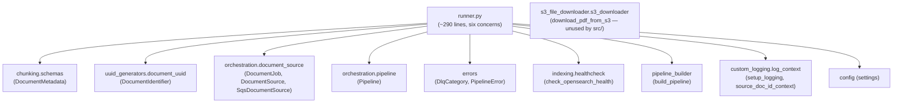
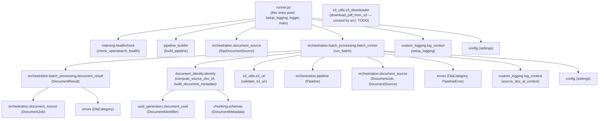
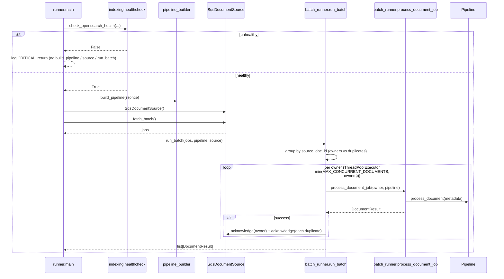

# Design — Runner Decomposition

## Overview

`src/ingestion_pipeline/runner.py` grew to ~290 lines while accreting six unrelated
concerns as the pipeline evolved through the parallel-processing and
duplicate-key-dedup features:

1. **S3 URI utilities** — `extract_case_ref` (dead) and `validate_s3_uri`.
2. **Document identity / metadata** — `compute_source_doc_id` and
   `build_document_metadata`.
3. **The `DocumentResult` outcome model** — the per-document result dataclass.
4. **Per-document worker logic** — `process_document_job`.
5. **Batch orchestration** — `run_batch` (dedup, concurrency, acknowledgement).
6. **Entry-point wiring** — `main()` and the `__main__` guard.

A file that both defines the batch execution engine *and* serves as the application
entry point is hard to navigate, hard to test in isolation, and blurs the line
between "how a batch runs" and "how the app is wired". This feature is a **pure
structural, behavior-preserving refactor**: every retained public function keeps its
name, signature, return value, raised-exception type, log output, and
acknowledgement decisions. Nothing about *what* the code does changes; only *where*
each piece lives.

The concerns are extracted into focused modules and packages, one dead function is
deleted, and the tests and the `structure.md` steering doc are updated to mirror the
new layout. The refactor is deliberately sequenced (see [Ordering / step plan](#ordering--step-plan))
so each step is independently verifiable.

### What is explicitly NOT changing

- No logic, control-flow, log-message, log-level, or acknowledgement change to any
  moved function.
- The dedup + concurrency semantics established in
  [`parallel-document-processing`](../parallel-document-processing/design.md) and
  [`duplicate-source-key-dedup`](../duplicate-source-key-dedup/design.md) are
  preserved verbatim (Property 1 — dedup; Property 2 — preservation of no-duplicate
  batches). This design does not re-derive those properties; it moves the code and
  the tests that guard them.
- `download_pdf_from_s3` is **not** consolidated with `S3DocumentService`. It moves
  verbatim and gains a TODO comment noting the deferred consolidation (see
  [Out of scope](#out-of-scope)).

## Architecture

### Before / After module dependency

#### Before



#### After



The dependency graph becomes acyclic and layered: `runner` depends on
`batch_runner`; `batch_runner` depends on the leaf modules (`document_identity`,
`s3_utils`, `document_result`); `document_identity` depends only on the existing
`uuid_generators` and `chunking.schemas`. No module imports `runner`.

### main() → run_batch → process_document_job sequence (preserved)

The runtime call sequence is unchanged; only the module boundaries the calls cross
are new.



### Ordering / step plan

Sequenced so each step compiles and its tests pass before the next begins. Aligned
to the requirements.

1. **Rename `s3_file_downloader/` → `s3_utils/`; split URI validation** (Req 1, 6, 9).
   Rename the package, add `s3_uri.py` with `validate_s3_uri`, add the TODO comment
   to `s3_downloader.py`. Update the one test import path and rename the test dir
   (`tests/s3_utils/` with `__init__.py`), add `test_s3_uri.py`.
2. **Create `document_identity/`** (Req 2, 9). Move `compute_source_doc_id` and
   `build_document_metadata` into `identity.py`; add `tests/document_identity/`.
3. **Create `orchestration/batch_processing/document_result.py`** (Req 3, 9). Move
   the `DocumentResult` dataclass; add `tests/orchestration/batch_processing/test_document_result.py`.
4. **Create `orchestration/batch_processing/batch_runner.py`** (Req 4, 7, 9). Move
   `process_document_job` and `run_batch`, wiring imports to steps 1–3. Migrate the
   worker/batch/dedup/concurrency tests plus the hypothesis property and preservation
   tests into `test_batch_runner.py`, retargeting `mock.patch` paths.
5. **Slim `runner.py`** (Req 5, 6). Remove moved symbols and the dead function;
   import `run_batch` from `batch_runner`. Trim `tests/test_runner.py` to the three
   `main` wiring tests.
6. **Update steering + verify** (Req 10, 11). Update `structure.md`; run the quality
   gates (`uv run pytest`, `ruff check`, `ruff format --check`, `deptry`).

## Components and Interfaces

### Per-module design

#### `src/ingestion_pipeline/s3_utils/` (rename of `s3_file_downloader/`)

Package produced by **renaming** the existing `s3_file_downloader/` package.
Satisfies Requirements 1, 6 (partial), 9.

**`__init__.py`** — package marker (mirrors the existing empty `s3_file_downloader/__init__.py`).

**`s3_downloader.py`** — `download_pdf_from_s3` moved **verbatim** from the renamed
package. No importers exist in `src/` (the production pipeline uses
`S3DocumentService`); only the test import path changes. Adds a TODO comment:

- Public surface: `download_pdf_from_s3(bucket_name: str, file_key: str, download_path: str)`
- TODO comment (new, non-behavioral): notes the function is currently unused by
  `src/` because the pipeline uses `S3DocumentService`, and that consolidation is
  deferred to future work (Requirement 1.5).

**`s3_uri.py`** — `validate_s3_uri` moved from `runner.py`, keeping the `re` import
local to this module.

- Public surface: `validate_s3_uri(s3_uri: str, expected_bucket: str) -> bool`
- Logic (unchanged): `re.match(rf"^s3://{re.escape(expected_bucket)}/\d{{2}}-[78]\d{{5}}/", s3_uri) is not None`
- Imports: `re`.

#### `src/ingestion_pipeline/document_identity/`

New package. Satisfies Requirements 2, 9.

**`__init__.py`** — package marker.

**`identity.py`** — `compute_source_doc_id` and `build_document_metadata` moved
**verbatim** from `runner.py` (including their `datetime` usage).

- Public surface:
  - `compute_source_doc_id(job: DocumentJob) -> str` — builds a `DocumentIdentifier`
    from `source_file_name`, `correspondence_type`, `case_ref` and returns
    `generate_uuid()`.
  - `build_document_metadata(job: DocumentJob, source_doc_id: str) -> DocumentMetadata`
    — `page_count=None`, `received_date=datetime.datetime.now(datetime.timezone.utc).replace(tzinfo=None)`
    (naive UTC now), other fields mapped from the job.
- Imports: `datetime`; `DocumentIdentifier` from
  `ingestion_pipeline.uuid_generators.document_uuid`; `DocumentMetadata` from
  `ingestion_pipeline.chunking.schemas`; `DocumentJob` from
  `ingestion_pipeline.orchestration.document_source` (for the type hints).

#### `src/ingestion_pipeline/orchestration/batch_processing/`

New package under the existing `orchestration/`. Satisfies Requirements 3, 4, 9.

**`__init__.py`** — package marker.

**`document_result.py`** — the `DocumentResult` dataclass moved **verbatim**
(including its class docstring).

- Public surface:
  ```python
  @dataclass
  class DocumentResult:
      job: DocumentJob
      source_doc_id: str
      success: bool
      error: Exception | None = None
      category: DlqCategory | None = None
      retryable: bool | None = None
  ```
- Imports: `dataclass` from `dataclasses`; `DocumentJob` from
  `ingestion_pipeline.orchestration.document_source`; `DlqCategory` from
  `ingestion_pipeline.errors`.

**`batch_runner.py`** — `process_document_job` and `run_batch` moved **verbatim**
(all logging, dedup grouping, worker sizing, acknowledgement, and error
classification unchanged). Its module-level `logger = logging.getLogger(__name__)`
is retained so per-module log attribution is unchanged in content.

- Public surface:
  - `process_document_job(job: DocumentJob, pipeline: Pipeline) -> DocumentResult`
  - `run_batch(jobs: list[DocumentJob], pipeline: Pipeline, source: DocumentSource) -> list[DocumentResult]`
- Imports: `logging`; `ThreadPoolExecutor, as_completed` from `concurrent.futures`;
  `DocumentResult` from `.document_result`; `compute_source_doc_id`,
  `build_document_metadata` from `ingestion_pipeline.document_identity.identity`;
  `validate_s3_uri` from `ingestion_pipeline.s3_utils.s3_uri`; `settings` from
  `ingestion_pipeline.config`; `source_doc_id_context` from
  `ingestion_pipeline.custom_logging.log_context`; `DlqCategory, PipelineError` from
  `ingestion_pipeline.errors`; `DocumentJob, DocumentSource` from
  `ingestion_pipeline.orchestration.document_source`; `Pipeline` from
  `ingestion_pipeline.orchestration.pipeline`.

#### `src/ingestion_pipeline/runner.py` (slimmed)

Reduced to a thin entry point. Satisfies Requirements 5, 6.

- Retains: module docstring, `setup_logging()` call at import, module `logger`,
  `main()`, and the `if __name__ == "__main__":` guard.
- Removes: `DocumentResult`, `extract_case_ref` (deleted, not relocated),
  `validate_s3_uri`, `compute_source_doc_id`, `build_document_metadata`,
  `process_document_job`, `run_batch`, and the now-unused imports (`datetime`, `re`,
  `dataclass`, `ThreadPoolExecutor`/`as_completed`, `DocumentMetadata`,
  `DocumentIdentifier`, `DlqCategory`/`PipelineError`, `DocumentJob`/`DocumentSource`,
  `Pipeline`, `source_doc_id_context`).
- Imports for `main`: `logging`; `settings` from `ingestion_pipeline.config`;
  `setup_logging` from `ingestion_pipeline.custom_logging.log_context`;
  `check_opensearch_health` from `ingestion_pipeline.indexing.healthcheck`;
  `SqsDocumentSource` (and `DocumentSource` for the local annotation) from
  `ingestion_pipeline.orchestration.document_source`; `build_pipeline` from
  `ingestion_pipeline.pipeline_builder`; `run_batch` from
  `ingestion_pipeline.orchestration.batch_processing.batch_runner`.
- `main()` body is unchanged: LOCAL_DEVELOPMENT_MODE warning → start log → health
  check early-exit → `build_pipeline()` once → `SqsDocumentSource()` →
  `source.fetch_batch()` → `run_batch(jobs, pipeline, source)` → finished log.

#### Dead code deletion

`extract_case_ref` is deleted **entirely** from `runner.py`, along with its docstring
and the preceding `# /\d{2}[-][78]d{5}/gm` regex comment. It has no importers or
callers in `src/` or `tests/`, so nothing else changes (Requirement 6).

### Import-rewiring table

Every call site / import that changes. All source moves are verbatim; only paths
change.

| # | Location | Before | After |
|---|----------|--------|-------|
| 1 | `runner.py` symbol `DocumentResult` | defined in `runner.py` | defined in `orchestration/batch_processing/document_result.py`; not referenced by `runner.py` |
| 2 | `runner.py` symbol `extract_case_ref` | defined in `runner.py` | **deleted** (no relocation) |
| 3 | `runner.py` symbol `validate_s3_uri` | defined in `runner.py` | `s3_utils/s3_uri.py` |
| 4 | `runner.py` symbols `compute_source_doc_id`, `build_document_metadata` | defined in `runner.py` | `document_identity/identity.py` |
| 5 | `runner.py` symbols `process_document_job`, `run_batch` | defined in `runner.py` | `orchestration/batch_processing/batch_runner.py` |
| 6 | `runner.py` import of `run_batch` | (defined locally) | `from ingestion_pipeline.orchestration.batch_processing.batch_runner import run_batch` |
| 7 | `s3_downloader.py` module path | `ingestion_pipeline.s3_file_downloader.s3_downloader` | `ingestion_pipeline.s3_utils.s3_downloader` |
| 8 | `tests/s3_file_downloader/test_s3_downloader.py` import | `from ingestion_pipeline.s3_file_downloader.s3_downloader import download_pdf_from_s3` | `tests/s3_utils/test_s3_downloader.py`: `from ingestion_pipeline.s3_utils.s3_downloader import download_pdf_from_s3` |
| 9 | `tests/test_runner.py` import | `from ingestion_pipeline.runner import compute_source_doc_id, main, process_document_job, run_batch` | split: `main` from `ingestion_pipeline.runner`; worker/batch symbols from `...batch_processing.batch_runner`; `compute_source_doc_id` from `document_identity.identity` |
| 10 | moved worker/batch tests `mock.patch("ingestion_pipeline.runner.settings")` | `ingestion_pipeline.runner.settings` | `ingestion_pipeline.orchestration.batch_processing.batch_runner.settings` |
| 11 | moved worker/batch tests `mock.patch("ingestion_pipeline.runner.ThreadPoolExecutor")` | `ingestion_pipeline.runner.ThreadPoolExecutor` | `ingestion_pipeline.orchestration.batch_processing.batch_runner.ThreadPoolExecutor` |
| 12 | `test_main_creates_correct_document_metadata` `mock.patch("ingestion_pipeline.runner.datetime")` | `ingestion_pipeline.runner.datetime` | `ingestion_pipeline.orchestration.batch_processing.batch_runner.datetime` (metadata built in `batch_runner` via `build_document_metadata`) |
| 13 | `structure.md` source-code table | `s3_file_downloader/` row | `s3_utils/` row + `document_identity/` row + `orchestration/batch_processing/` note; no residual `s3_file_downloader` reference |

## Data Models

This is a structural refactor, so **no new data models are introduced**. The only
data model relocated by this change is the `DocumentResult` outcome dataclass, which
moves verbatim from `runner.py` to
`orchestration/batch_processing/document_result.py`.

### `DocumentResult`

Per-document outcome record produced by `process_document_job` and returned in the
list from `run_batch`.

| Field | Type | Default | Meaning |
|-------|------|---------|---------|
| `job` | `DocumentJob` | — | The job that was processed. |
| `source_doc_id` | `str` | — | Deterministic document identity computed for the job. |
| `success` | `bool` | — | Whether processing completed without error. |
| `error` | `Exception \| None` | `None` | The exception raised on failure, if any. |
| `category` | `DlqCategory \| None` | `None` | DLQ classification on failure. |
| `retryable` | `bool \| None` | `None` | Whether the failure is retryable. |

`DocumentMetadata` (from `chunking.schemas`) and `DocumentJob` (from
`orchestration.document_source`) are **existing models reused unchanged**; this
refactor does not alter their fields or behavior.

## Correctness Properties

This is a **behavior-preserving structural refactor introducing no new logic**, so
**no new correctness properties are derived** here. Every moved function keeps its
name, signature, return value, raised-exception type, log output, and acknowledgement
decisions; there is no new behavior to specify.

The existing hypothesis property-based tests continue to guard the same properties
they already validated. Specifically, **Property 1 (dedup)** and **Property 2
(preservation of no-duplicate batches)** from the
[`duplicate-source-key-dedup`](../duplicate-source-key-dedup/design.md) spec are
**moved, not re-authored** — they are relocated verbatim into `test_batch_runner.py`
and continue to guard the same dedup and preservation semantics against the moved
`run_batch`/`process_document_job` code.

Verification that behavior is preserved is enumerated in the
[Behavior preservation checklist](#behavior-preservation-checklist) below rather than
via newly derived properties.

## Error Handling

The error-handling behavior of every moved function is **preserved verbatim**; none
of the classification, logging, or propagation described here changes.

**`process_document_job`** — outcome classification is unchanged:

- **Clean return** → `DocumentResult(success=True)` with default `error`, `category`,
  and `retryable` (all `None`).
- **`PipelineError`** → `DocumentResult(success=False)` carrying the exception's
  `category` (`exc.category`) and `retryable` (`exc.retryable`), plus an `error`-level
  log noting the document is "not acknowledging".
- **Any other `Exception`** → `DocumentResult(success=False)` with
  `DlqCategory.UNEXPECTED` and `retryable=False`, plus a `critical`-level log.

**`download_pdf_from_s3`** — continues to propagate `ClientError` to the caller
unchanged.

None of this error-handling behavior changes as part of this refactor.

## Testing strategy

This is a behavior-preserving structural refactor of code that is **not** IaC, UI,
or simple CRUD, and the existing suite already includes property-based (hypothesis)
tests for the dedup/preservation semantics. Those property tests are **moved, not
re-authored** — the design does not introduce new correctness properties. The
properties they guard are the ones already defined in the source specs:

- **Property 1 (dedup)** and **Property 2 (preservation)** from
  [`duplicate-source-key-dedup`](../duplicate-source-key-dedup/design.md) — moved
  verbatim into `test_batch_runner.py`.

Because no new logic is introduced, no new correctness property is derived here; the
verification goal is that every moved test passes unchanged (Requirement 7.2, 7.4 —
no assertion weakened, skipped, or marked xfail).

### Test module → requirements mapping

| Test module | Covers | Requirements |
|-------------|--------|--------------|
| `tests/s3_utils/test_s3_downloader.py` | `download_pdf_from_s3` success + `ClientError` propagation (moved unittest `TestCase`, import path only) | 1.2, 1.3, 8.1, 8.3 |
| `tests/s3_utils/test_s3_uri.py` (new) | `validate_s3_uri`: valid URIs, wrong-bucket, malformed case-ref patterns | 1.4, 8.2 |
| `tests/document_identity/test_identity.py` (new) | `compute_source_doc_id` determinism (equal keys → same UUID, differing keys → different UUID); `build_document_metadata` field mapping (`page_count=None`, naive UTC `received_date`, mapped fields) | 2.2, 2.3, 2.4, 8.4 |
| `tests/orchestration/batch_processing/test_document_result.py` (new) | `DocumentResult` construction + default values (`error`/`category`/`retryable` default `None`) | 3.2, 8.5 |
| `tests/orchestration/batch_processing/test_batch_runner.py` | worker success/invalid-URI/exception classification, log-context reset, `run_batch` empty/mixed/acknowledgement, worker sizing, dedup, plus moved hypothesis Property 1 + preservation tests | 4.1–4.12, 7.1–7.5, 8.6 |
| `tests/test_runner.py` (trimmed) | `main` wiring only: successful execution, health-check early-exit, metadata correctness | 5.1, 5.2, 5.4, 5.5, 8.8 |

### mock.patch retarget details

Patch targets follow the module where the name is **looked up**, so moving a function
moves the patch target with it:

- Worker/batch tests that patched `ingestion_pipeline.runner.settings`,
  `ingestion_pipeline.runner.ThreadPoolExecutor`, and (for the metadata `datetime`
  freeze) `ingestion_pipeline.runner.datetime` retarget to
  `ingestion_pipeline.orchestration.batch_processing.batch_runner.{settings,ThreadPoolExecutor,datetime}`.
- `compute_source_doc_id` is imported in the moved tests from
  `ingestion_pipeline.document_identity.identity`; `DocumentIdentifier` continues to
  come from `ingestion_pipeline.uuid_generators.document_uuid`.
- `main` wiring tests keep patching `ingestion_pipeline.runner.*` for
  `SqsDocumentSource`, `build_pipeline`, `check_opensearch_health`, and `logger`
  (those names are still looked up in `runner`). **Note:** the metadata-correctness
  test's `datetime` freeze must target `batch_runner`, because
  `build_document_metadata` — which reads the clock — now lives there, not in
  `runner`.

### Conventions (Requirement 9)

Each new package carries an `__init__.py`; each new module carries a Google-style
module docstring; every moved/new public function and class keeps its Google-style
docstring; double-quoted strings; no line over 120 chars; no `print`. Ruff (E, F, W,
I, T20, D; Google convention) reports zero violations. `pytest-cov` stays at or above
the 90% threshold (`--cov-fail-under=90`).

## Behavior preservation checklist

For every moved function, the following are byte-for-byte unchanged (Requirement 7):

- [ ] **Log messages & levels** — the `info`/`warning`/`error`/`critical` calls in
      `process_document_job` and `run_batch` (generated `source_doc_id` line,
      duplicate-collapse warning, batch-summary line, error/critical classification
      lines) keep identical format strings, levels, and `exc_info` flags.
- [ ] **Acknowledgement decisions** — on owner success: acknowledge owner + each
      collapsed duplicate; on failure: leave owner and duplicates unacknowledged.
- [ ] **Worker sizing** — `max_workers = min(settings.MAX_CONCURRENT_DOCUMENTS, len(owners))`.
- [ ] **Dedup ordering** — first job per `source_doc_id` is the owner; input order
      preserved; one `DocumentResult` per owner, none for duplicates.
- [ ] **Context token** — `source_doc_id_context.set(...)` at entry,
      `reset(token)` in `finally` on both success and failure paths.
- [ ] **Error classification** — clean return → `success=True` (defaults for
      `error`/`category`/`retryable`); `PipelineError` → `success=False` with the
      exception's `category`/`retryable`; any other exception → `success=False`,
      `DlqCategory.UNEXPECTED`, `retryable=False`.
- [ ] **Empty batch** — `run_batch([], ...)` logs "no documents", returns `[]`, no
      thread pool created.
- [ ] **`main` sequence** — LOCAL_DEVELOPMENT_MODE warning, start log, health-check
      early-exit (no build/source/run_batch on unhealthy), single `build_pipeline`,
      single `SqsDocumentSource`, `fetch_batch`, single `run_batch`, finished log.
- [ ] **`validate_s3_uri`** — identical regex and return semantics.
- [ ] **`download_pdf_from_s3`** — identical body (verbatim move; TODO comment only).

## Out of scope

- **`S3DocumentService` consolidation.** `download_pdf_from_s3` remains a separate,
  currently-unused function. It moves verbatim and gains a TODO comment flagging the
  deferred consolidation. Merging the two S3 download paths is future work.
- **Any logic change.** No behavior, log line, control-flow, acknowledgement policy,
  worker-sizing, or error-classification change is in scope. If a change would alter
  observable behavior, it does not belong to this refactor.
