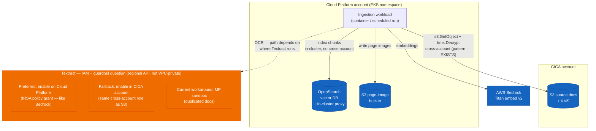
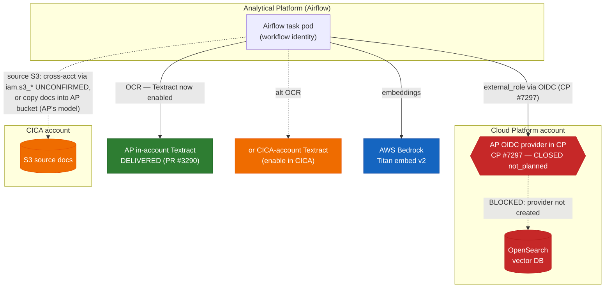
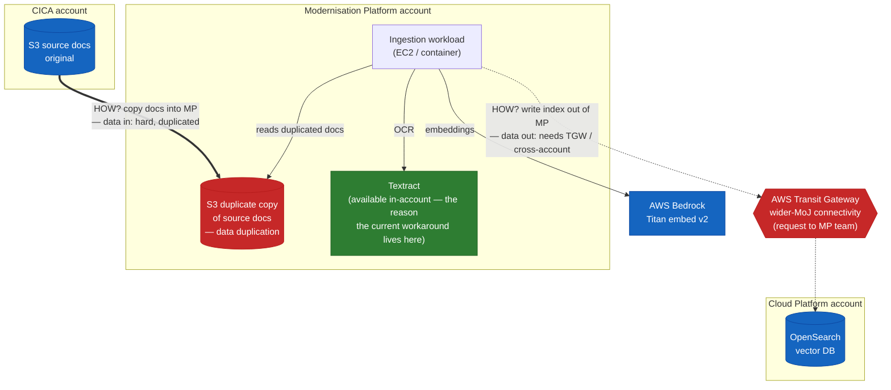
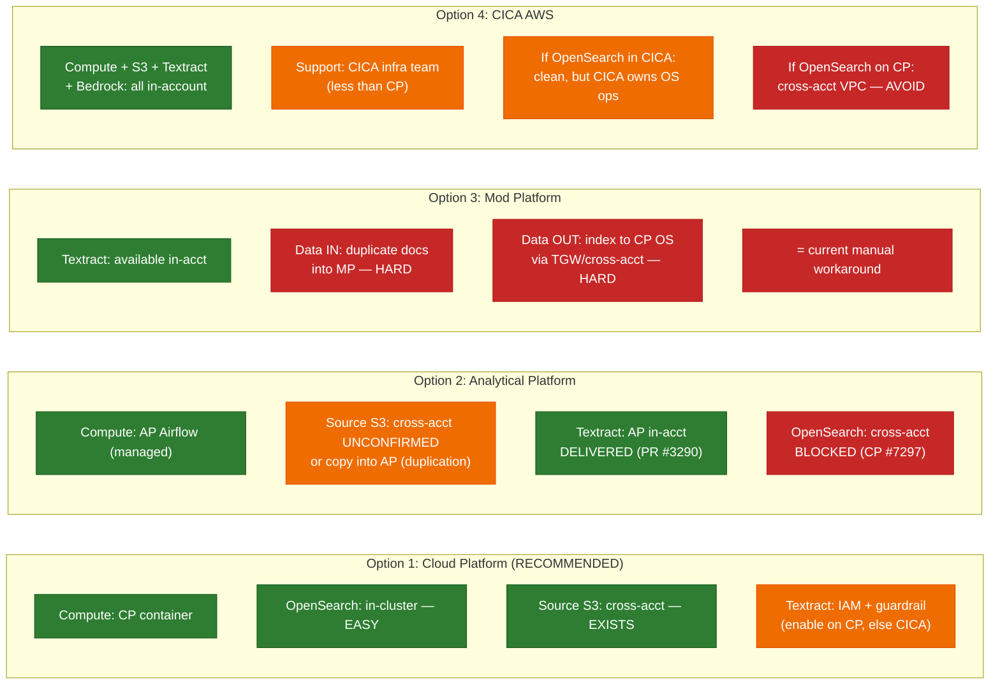

# Ingestion Hosting & Cross-Account Connectivity Assessment

Assessment of **where the ingestion pipeline should run** (Cloud Platform, Analytical
Platform, Modernisation Platform, or CICA AWS) and how it reaches the AWS resources it
depends on — source S3 (CICA), Textract, Bedrock, and OpenSearch (Cloud Platform).

This is a decision-support document, not a runbook. No infrastructure has been
changed. It records what has been confirmed with the platform teams, what is blocked,
the networking/IAM model that explains why, and the recommended path for the current
private beta. The recommended target is **Cloud Platform compute with Textract enabled
on Cloud Platform** (Option E).

## Summary

The clean "one external IAM role on AP reaching all resources" design is **not
currently viable**. Cross-account S3 to an external (CICA) bucket from an Airflow
workflow is **unconfirmed** — the documented and demonstrably-used `iam.s3_*` grants are
for AP-owned buckets, and AP's actual model for external data is to **ingest it into an
AP bucket** (see "AP's data model" below) — while cross-account OpenSearch is not in the
current model and the one documented workaround depends on a Cloud Platform change that
has been declined. Textract will not be enabled
cross-account; AP has now enabled Textract **in-account** (AP Airflow PR [#3290](https://github.com/ministryofjustice/analytical-platform-airflow/pull/3290)). AP is a
**conditional** option: in test/prod the AP→CP network path exists (MoJO Transit Gateway),
so the OpenSearch leg is blocked on **identity**, not network — it needs AP's OIDC provider
in the CP account (CP [#7297](https://github.com/ministryofjustice/cloud-platform/issues/7297), closed `not_planned`) plus an off-cluster reachability design.
If CP [#7297](https://github.com/ministryofjustice/cloud-platform/issues/7297) were delivered, AP becomes viable; until then AP cannot write to CP OpenSearch.
See "How Option 2 would be implemented".

Recommended target: **run the ingestion code on Cloud Platform and enable AWS Textract
on Cloud Platform** (Option E). Textract is a regional AWS service with a public API
endpoint, so making it callable from a CP workload is an **IAM-permissions question, not
a networking one** — the same shape as the Bedrock access CP already grants. If CP will
not permit Textract (an organisational guardrail/SCP question, not a technical one),
**enable Textract in the CICA account** as the fallback (Option E2); the CP workload
already assumes a CICA role for S3, so the same pattern extends to Textract. Both keep
OpenSearch trivial (in-cluster on CP) and avoid AP's blocked OIDC provider and MP's data
duplication. Textract is in the [**Adopt**](https://tech-radar.justice.gov.uk/platforms-and-operations/aws-textract/) ring of the [MoJ tech radar](https://tech-radar.justice.gov.uk/), which strengthens
the enablement ask. In the interim, continue running the pipeline as it runs today (see
Current state) and do not invest in the AP external-role infrastructure while the
blocking Cloud Platform ticket (CP [#7297](https://github.com/ministryofjustice/cloud-platform/issues/7297)) remains `not_planned`.

## Current state (how indexing runs today)

Indexing does **not** run on Cloud Platform or on Analytical Platform. It currently runs
**manually on a developer's local machine**, which has credentials into a
**Modernisation Platform (MP) sandbox account**:

- Textract is provided through a **workaround in the MP sandbox**, not from CICA or AP
  directly. The MP sandbox holds a **duplicate copy of the documents to be ingested**,
  so Textract reads its input from an MP bucket rather than reading cross-account from
  the CICA source bucket at ingest time.
- The local machine also has access to CICA dev environment resources.
- The target OpenSearch domain is the Cloud Platform one (reached from local via
  `kubectl port-forward` to the in-cluster proxy during development).

This maps to the `USE_MOD_PLATFORM_MODE` flag and the `AWS_MOD_PLATFORM_*` /
`AWS_LOCAL_DEV_TEXTRACT_S3_ROOT_BUCKET` (`mod-platform-sandbox-kta-documents-bucket`)
settings in `config.py`.

The MP sandbox + duplicate-document arrangement is explicitly a **workaround to obtain
Textract**, because neither AP nor a cross-account CICA setup provides it in a supported
way (see AP [#8344](https://github.com/ministryofjustice/analytical-platform/issues/8344)). This workaround should be replaced with a scheduled run or a continuously running document ingestion application.

## Platform context

Multiple MoJ platforms are involved and must not be conflated:

- **Analytical Platform (AP) Airflow** — where the Airflow task pod (compute) would
  run. Source of the `iam.external_role` / workflow-identity mechanism and
  `workflow.yml` manifest.
- **Cloud Platform (CP)** — the EKS namespace where **OpenSearch already runs** behind an in-cluster proxy. A cross-account IAM role provides the ingestion workload with access to the source documents held in the CICA AWS account.

- **Modernisation Platform (MP)** — a sandbox account currently used (from a local
  machine) to provide Textract via a workaround, holding a duplicate copy of the source
  documents. MP is for hosting applications not suitable for Cloud Platform.

The CICA AWS account holds the source document S3 bucket and its KMS key. The account ID, bucket name and KMS key ARN are supplied through environment-specific configuration.

Other MoJ platforms seen while investigating (not hosting candidates for this pipeline,
but useful for understanding the connectivity model):

- **Container Platform** — a separate MoJ hosting platform, a sibling of Cloud Platform,
  built on the Modernisation Platform using the isolated-network option (confirmed by the
  MP centralised VPC endpoints docs, which name Cloud Platform and Container Platform as
  the consumer accounts). It has its own
  [user guide](https://user-guide.development.container-platform.service.justice.gov.uk/)
  (currently **alpha / under construction**, page owner `#cloud-platform-notify`, so it is
  closely tied to the Cloud Platform team) and is **not** Analytical Platform. The guide
  already documents "Connecting to a Cloud Platform database", which is the user-facing
  surface of the CP [#8574](https://github.com/ministryofjustice/cloud-platform/issues/8574)/[#8575](https://github.com/ministryofjustice/cloud-platform/issues/8575)
  base-networking tickets (TGW routing to CP RDS). These illustrate the Container
  Platform ↔ Cloud Platform networking effort but do not touch OpenSearch, AP, or this
  pipeline. Container Platform is not currently a hosting candidate here (alpha, and the
  cross-platform story is RDS, not OpenSearch), but is worth watching as it matures.

## Why cross-account differs by service: the two-lock model

A recurring theme below is that "cross-account support" means different things for
different AWS services. The distinction is **where the request is evaluated** and
therefore **whether it must traverse a private network at all**:

- **Regional services with public API endpoints** (S3, Textract, Bedrock, SQS, SNS, STS,
  KMS). Reachability is free — any workload with normal AWS egress can hit the endpoint.
  The only "lock" is **IAM** (the caller's identity policy, plus any resource policy such
  as an S3 bucket policy). Cross-account for these = IAM only.
- **VPC-private resources** (an Amazon OpenSearch Service VPC domain, RDS, ElastiCache).
  The endpoint is a private IP inside a specific VPC behind a security group. Before IAM
  is even consulted, the request must **physically reach that private IP**, which needs a
  network path into the VPC (same-cluster, VPC peering, Transit Gateway, or PrivateLink).
  Cross-account for these = **two locks: network reachability AND IAM/authorization**,
  and both must be satisfied independently.

| | Public-endpoint service (S3, Textract, Bedrock) | VPC-private resource (OpenSearch domain, RDS) |
|---|---|---|
| Endpoint | Public (regional) | Private IP inside a VPC |
| Network reachability | Free (just egress) | Needs a route into the VPC |
| Authorization | IAM (+ resource policy) | IAM / fine-grained access control |
| "Cross-account" means | IAM only | Network **and** IAM |

Practical consequences:

- **Local development** reaches CP OpenSearch via `kubectl port-forward`, which solves
  the *network* half (tunnelling into the cluster/VPC where the private domain lives);
  the in-cluster proxy handles the signing/authorization half. Both halves are always
  required for a VPC-private resource.
- **Textract is public-endpoint / IAM-only.** Enabling it for a CP workload is a policy
  change (plus the absence of an org guardrail), not a VPC/TGW exercise — unlike
  OpenSearch. The existing CP Bedrock enablement (`opensearch-connector-bedrock.tf`) is
  the precedent: it was fundamentally an IAM role granting `bedrock:*` actions.
- **MP centralised VPC endpoints** (hub of interface endpoints shared over TGW to
  isolated-network accounts) is a *network-reachability* mechanism for AWS **service
  APIs**. Its current service list does **not** include `textract` or `es`/OpenSearch
  (it does include `transcribe`, `rds`, `sqs`, `sns`, `kms`, `sts`, etc.). It would not,
  as-is, provide private Textract or reach CP's OpenSearch *domain*; and this pipeline's
  compute is not on the isolated-network model anyway. Verify against
  [`centralised-vpc-endpoints.json`](https://github.com/ministryofjustice/modernisation-platform/blob/main/terraform/environments/core-network-services/centralised-vpc-endpoints.json) if this ever becomes load-bearing.

## What is confirmed vs blocked

| Capability | Verdict | Source |
|---|---|---|
| AP Airflow -> AP-owned S3 buckets (`iam.s3_*`) | Supported; standard everyday use (buckets are `mojap-*`/`alpha-*`) | AP workflow examples in `analytical-platform-airflow` |
| AP Airflow workflow role -> CICA (external) S3 bucket via `iam.s3_*` | **Unconfirmed.** `iam.s3_*` is demonstrably used for AP-owned buckets; Slack implied external works, but repo evidence does not corroborate — verify with AP | Slack (AP) vs AP workflow examples |
| External data INTO an AP bucket (bucket policy trusting AP role) | Supported, but documented for the **ingestion service** `transfer` role, not an arbitrary workflow role | AP ingestion service docs |
| AP Airflow -> Cloud Platform OpenSearch (cross-account write) | Not in the current model | Slack (AP) |
| `external_role` workaround to reach CP OpenSearch | Requires AP OIDC provider created in the CP account first | Slack (AP) + CP [#7297](https://github.com/ministryofjustice/cloud-platform/issues/7297) |
| CP [#7297](https://github.com/ministryofjustice/cloud-platform/issues/7297) "Add AP Compute OIDC to Cloud Platform" (the prerequisite) | Closed `not_planned` (2026-06-17) | CP [#7297](https://github.com/ministryofjustice/cloud-platform/issues/7297) |
| Textract via Airflow, cross-account | Will not be enabled; cross-account intentionally unsupported | AP [#8344](https://github.com/ministryofjustice/analytical-platform/issues/8344) |
| Textract within Analytical Platform (in-account) | **Delivered** (AP Airflow [PR #3290](https://github.com/ministryofjustice/analytical-platform-airflow/pull/3290), 2026-02-26); workflow sets `Textract: true` + `s3_read_only` | AP [#8344](https://github.com/ministryofjustice/analytical-platform/issues/8344) / [#9147](https://github.com/ministryofjustice/analytical-platform/issues/9147) |
| Textract on Cloud Platform (IAM-only; regional API, not VPC-private) | Open — a guardrail/SCP question for the CP team, not a technical blocker | This assessment; Bedrock precedent |
| Textract in the CICA account (IAM-only) | Open — CICA infra team owns their account; viable fallback | This assessment |
| Textract org-level endorsement | [**Adopt**](https://tech-radar.justice.gov.uk/platforms-and-operations/aws-textract/) on the [MoJ tech radar](https://tech-radar.justice.gov.uk/) | [MoJ tech radar](https://tech-radar.justice.gov.uk/) (Platforms & Operations) |

## Ingestion option diagrams

Colour key: green = works / supported, amber = open question, red = blocked / hard.

The hard constraint moves depending on where the workload runs. On Cloud Platform
everything is green except Textract; on Analytical Platform, Textract is awkward and
OpenSearch is blocked; on Modernisation Platform, Textract is easy but both data legs
(docs in, index out) are hard.

### Option 1 — Ingestion on Cloud Platform

Strong on everything except Textract. OpenSearch is in-cluster (no cross-account, no
network hop) and the cross-account read of the CICA source bucket already exists. The only open question is where Textract runs. Because Textract is a
regional/public-endpoint service, this is an **IAM + guardrail** question, not a
networking one: ideally enable it **on Cloud Platform** (an IRSA policy grant, like the
existing Bedrock access), or failing that **in CICA** (same cross-account role pattern
already used for S3).

### Option 2 — Ingestion on Analytical Platform (Airflow)

Managed compute, in-account Textract (now delivered, PR [#3290](https://github.com/ministryofjustice/analytical-platform-airflow/pull/3290)) and Bedrock. Getting
the CICA source documents in is **not settled**: cross-account S3 to an external CICA
bucket from a workflow role is unconfirmed, and AP's documented model is to copy external
data into an AP bucket first (reintroducing duplication) — see "AP's data model" below.
The hardest leg is OpenSearch: writing to the CP domain needs the `external_role`/OIDC
path, which is gated on the declined CP
[#7297](https://github.com/ministryofjustice/cloud-platform/issues/7297) (no AP OIDC
provider in the CP account). **AP is therefore a conditional option — viable in test/prod
if and only if CP [#7297](https://github.com/ministryofjustice/cloud-platform/issues/7297) (or an equivalent OIDC trust) is delivered.** See
"How Option 2 would be implemented" below for the full build.

#### How Option 2 would be implemented

Setting aside AP `development` (which is not on the MoJO Transit Gateway), the question is
whether AP works in **test/prod**. Both "locks" (network reachability and IAM identity)
*can* be opened there, so AP is a genuine option — gated on one cross-team dependency we
do not control (CP [#7297](https://github.com/ministryofjustice/cloud-platform/issues/7297)).

**Network (lock 1) — present in test/prod.** AP's Kubernetes infrastructure is connected
to the MoJO Transit Gateway, which reaches MoJ Cloud Platform (per the AP Airflow
overview). So the AP→CP network path exists in test and production. It is explicitly
**not** present in AP `development`. This corrects the earlier framing in this document
that treated the AP→CP network path as simply absent — it is absent only in dev.

| AP environment | On MoJO Transit Gateway → Cloud Platform? |
|---|---|
| development | No (explicitly not connected) |
| test | Yes |
| production | Yes |

**Identity (lock 2) — the gating item.** Writing to the CP OpenSearch domain needs an IAM
identity CP trusts, via AP's `external_role` mechanism, which requires AP's OIDC provider
to exist in the CP account. That is CP [#7297](https://github.com/ministryofjustice/cloud-platform/issues/7297), closed `not_planned`. Without it, no AP
environment (test/prod included) can assume a CP role, so OpenSearch stays blocked even
though the network path exists.

The build, in dependency order (layers 1–3 are the OpenSearch spine; Textract/Bedrock/S3
are routine):

1. **OIDC trust anchor (CP side) — prerequisite.** CP creates an
   `aws_iam_openid_connect_provider` in the CP account for AP's EKS OIDC issuer URL (AP
   provides the URL on request). This is CP [#7297](https://github.com/ministryofjustice/cloud-platform/issues/7297). Nothing downstream works without it.
2. **External IRSA role (CP side).** An IAM role in the CP account whose trust policy
   federates to that OIDC provider, scoped to the AP workflow service account using the
   AP convention `mwaa:${project}-${workflow}`. Its permission policy grants OpenSearch
   data-plane access (`es:ESHttp*` on the domain ARN, or the FGAC backend role if the
   domain uses fine-grained access control). This is the role `iam.external_role` points
   at.
3. **OpenSearch domain access + reachability (CP side).** The domain access policy / FGAC
   must admit that external role as a principal. **Reachability caveat:** the domain is
   VPC-private and is reached today via an **in-cluster proxy service**
   (`...svc.cluster.local`) that an off-cluster AP pod cannot resolve or route to. Being
   on the TGW gets AP into the CP VPC, but the OpenSearch endpoint still has to be
   reachable over that VPC path (hitting the domain's VPC endpoint directly and signing
   requests, not the in-cluster proxy). How an off-cluster, cross-account caller should
   reach the domain is a real design question to settle with CP — not a given.
4. **AP workflow manifest (AP side) — `workflow.yml`.**
   - `iam.external_role: arn:aws:iam::<CP_ACCOUNT>:role/<role from step 2>` — the pod
     assumes the CP role (this *replaces* the pod's default AP identity; see the S3 note
     below).
   - `Textract: true` **and** `iam.s3_read_only: [...]` — AP in-account Textract (PR [#3290](https://github.com/ministryofjustice/analytical-platform-airflow/pull/3290)
     requires both together).
   - `bedrock: true` — AP in-account Bedrock.
   - cross-account S3 grant for the CICA source bucket (see the S3 note below).
   - `env_vars`: the reachable OpenSearch endpoint (not the in-cluster proxy URL), index
     names, and `AWS_REGION=eu-west-2` (AP defaults `AWS_DEFAULT_REGION=eu-west-1`).
5. **Pipeline code (our side) — minor.** Point `OPENSEARCH_PROXY_URL` at the reachable
   endpoint from step 3; drop `USE_MOD_PLATFORM_MODE` and the static `AWS_*` keys (the
   assumed role supplies credentials via the SDK chain); and prefer a terminating
   drain-until-empty run over the infinite forever-poll, since an Airflow task is expected
   to end (separate code decision).

**Important — S3 cross-account is a different mechanism from `external_role`.** They are
two distinct, and partly conflicting, mechanisms:

- **The `iam.s3_*` grant uses the AP workflow's own (AP-account) identity**
  `airflow-${environment}-${project}-${workflow}`. In the observed real-world workflows
  in `analytical-platform-airflow`, these grants point at **AP-owned** buckets
  (`mojap-*`, `alpha-*`). Slack said a cross-account bucket also works (CICA bucket policy
  trusting that AP role, no `external_role`), but the repo evidence does not corroborate
  that for an arbitrary external bucket, so **treat AP-workflow → external-CICA-bucket via
  `iam.s3_*` as unconfirmed and verify with AP.**
- **`external_role` replaces the pod's identity** with a role in one specific other
  account (here, CP, for OpenSearch).

Because `external_role` targets a **single** account, we cannot simultaneously "be a CP
principal (for OpenSearch) via `external_role`" and rely on the default-AP-identity S3
pattern against CICA — the pod only presents one identity. If Option 2 uses
`external_role` → CP, then CICA S3 access must be arranged for *that presented identity*
(a CICA bucket policy trusting the CP role, or a further `sts:AssumeRole` hop into CICA),
not via the standard AP-workflow-identity S3 grant. This interaction is a design point to
resolve, not a blocker.

**Data location in this model:** Textract + Bedrock in-account on AP; source documents
either read cross-account from CICA (unconfirmed, see below) **or copied into an AP
bucket first** (AP's documented model); OpenSearch the one cross-account + cross-network
leg (layers 1–3); page-image output S3 wherever chosen.

**Net:** Option 2 is viable in test/prod **if** CP delivers the OIDC provider (#7297)
and an off-cluster OpenSearch reachability design is agreed, **and** the CICA source data
is either confirmed-reachable cross-account or copied into AP. Textract and Bedrock are
proven; the S3 source leg is less settled than first assumed. It remains behind Option 1
(CP compute) on *least work*, because Option 1 avoids layers 1–3 entirely (OpenSearch
in-cluster, no OIDC provider, no cross-account OpenSearch) and reads the CICA source
bucket via the already-wired `irsa-cica-s3` role. The first action if pursuing AP is to
ask CP whether they will reconsider [#7297](https://github.com/ministryofjustice/cloud-platform/issues/7297) for a test/prod AP workflow.

#### AP's data model: ingest into AP, not reach out

A pattern worth noting across all the AP evidence: **AP's model is to bring external data
*into* an AP bucket, not to have AP workloads reach *out* into other accounts.**

- Real `analytical-platform-airflow` workflows grant `iam.s3_*` on **AP-owned** buckets
  (`mojap-*`, `alpha-*`), not external-account buckets.
- AP's documented route for receiving external/supplier data is the managed
  [**ingestion service**](https://user-guidance.analytical-platform.service.justice.gov.uk/tools/ingestion/)
  (SFTP/Transfer Family + GuardDuty scanning) that **copies files into an AP destination
  bucket**. Where a destination bucket sits outside AP, the pattern is a **bucket policy
  trusting AP's ingestion `transfer` role** — i.e. the far account grants AP in, rather
  than AP federating out.
- AP #8344 explicitly discourages cross-account functionality.

The consequence for this pipeline: the AP-shaped design is likely **copy the CICA
documents into an AP bucket, then process in-account** — which reintroduces the same
**document duplication** that makes the current MP workaround unattractive. That is a
point *against* AP relative to Option 1, where the CICA source bucket is read in place via
the existing cross-account role with no duplication.

**Is the ingestion service even a usable fit here?** Probably not cleanly, for several
operational reasons from its docs:

- It is a **supplier-push SFTP** model (AWS Transfer Family): an external party uploads to
  a landing bucket and GuardDuty scans each file before clean files are moved to the
  destination. It is designed for *a supplier sending us data*, not for an AP workload to
  **pull an existing CICA S3 bucket** into AP — so it does not map neatly onto "the
  documents are already in a CICA bucket".
- **5 GB per-file limit** — larger files must be split.
- **No transformation** and **one destination bucket per user** (separate usernames for
  test vs prod); it only copies files, it does not process them.
- For a destination bucket **outside** AP, the setup is a bucket policy granting AP's
  ingestion `transfer` role the S3 actions (and a KMS key-policy grant if encrypted); the
  per-environment ingestion account IDs are in the AP ingestion docs.

So even AP's own inward-ingest mechanism is an awkward fit: it would mean an external
system pushing CICA documents in via SFTP (or building a bespoke copy step), plus
duplication, plus the 5 GB/no-transform constraints. This reinforces that AP's data model
does not fit a pipeline whose source already lives in a CICA S3 bucket — unlike Option 1,
which reads that bucket in place.

### Option 3 — Ingestion on Modernisation Platform

MP's one advantage is Textract in-account (the reason the current workaround lives
there). But it has the data-movement problem on both sides: getting documents in means a
duplicate copy, and getting the index out to CP OpenSearch means cross-account over
Transit Gateway (MP uses AWS Transit Gateway for private wider-MoJ connectivity, by
request to the MP team). This is essentially the current manual workaround — not a
strong destination.

### Comparison

### Recommended target and ranking

Run the ingestion code on **Cloud Platform** and make **Textract** callable from it —
ideally by enabling Textract on Cloud Platform, otherwise in CICA. This keeps OpenSearch
trivial (in-cluster) and the CICA S3 read already works, so the only thing to resolve is
the Textract permission, which is IAM-only (not a VPC/network problem).

Ranked, best to worst:

1. **CP compute + Textract on CP.** Least new work. OpenSearch stays where it is and is
   platform-managed; Textract is an IRSA policy grant subject to CP guardrails. Backed by
   the Bedrock precedent and Textract's [**Adopt**](https://tech-radar.justice.gov.uk/platforms-and-operations/aws-textract/) rating on the [MoJ tech radar](https://tech-radar.justice.gov.uk/).
2. **CP compute + Textract in CICA (fallback).** If CP will not permit Textract. One
   extra in-account→CICA hop for Textract, reusing the existing cross account IAM role pattern.
   Keep source docs and Textract's S3 output co-located in CICA to avoid an extra hop for
   Textract's own I/O.
3. **CICA compute + CICA OpenSearch (full single-account stack).** Architecturally clean
   — everything in one account, no cross-account anything. But CICA then owns and operates
   an OpenSearch cluster with less platform support than CP. Justified only if there is a
   reason to consolidate in CICA (data residency, org policy, or Textract never permitted
   on CP).
4. **CICA compute + CP OpenSearch — AVOID.** Puts the one cross-account boundary on the
   single VPC-private service, reintroducing the two-lock (network + IAM) problem for no
   benefit over option 3.
5. **Analytical Platform / Modernisation Platform — blocked or workaround-only** (see
   Options A–D). AP's OpenSearch route is blocked by CP [#7297](https://github.com/ministryofjustice/cloud-platform/issues/7297) (`not_planned`); MP is the
   current manual workaround.

The deciding question between 1/2 and 3 is simply: *is there any reason OpenSearch must
leave Cloud Platform?* If not, keeping it on CP (and therefore compute on CP) wins on
operational support alone.

## Evidence

### Slack thread with Analytical Platform

- Cross-account **S3** from Airflow was described as supported: add a bucket policy on
  the CP/CICA bucket granting the AP workflow role, then grant the bucket on the Airflow
  side via the `iam` workflow-identity keys.

  **Caveat (added later):** real workflows in `analytical-platform-airflow` only use
  `iam.s3_*` for AP-owned buckets (`mojap-*`/`alpha-*`), and AP's documented external-data
  route is the ingestion service (copy into an AP bucket), not reaching out to an external
  bucket. So this Slack claim is **not corroborated** for an arbitrary external CICA bucket
  via a workflow role and should be verified with AP before relying on it.
- Writing to a **CP OpenSearch index is "not in the current model."** The only route
  offered is the `external_role` advanced configuration, and that requires AP to liaise
  with Cloud Platform to get AP's OIDC provider(s) set up in the CP account.

_Content rephrased for compliance with licensing restrictions._

### AP issue #8344 — Feature request for Textract via Airflow (closed)

- AP will **not** enable Textract in a cross-account setup. Cross-account is
  intentionally unsupported for support manageability and security reasons, and because
  many functions are blocked by default under cross-account use.
- AP **has now enabled Textract in-account on Analytical Platform** via AP [#9147](https://github.com/ministryofjustice/analytical-platform/issues/9147) /
  AP Airflow [PR #3290](https://github.com/ministryofjustice/analytical-platform-airflow/pull/3290)
  (merged 2026-02-26). An AP workflow sets `Textract: true` in its manifest (with
  `s3_read_only` also required). This is the in-account delivery promised by #8344;
  cross-account remains unsupported.
- Link: https://github.com/ministryofjustice/analytical-platform/issues/8344

_Content rephrased for compliance with licensing restrictions._

### CP issue #7297 — Add Analytical Platform Compute OIDC to Cloud Platform

- This is the exact prerequisite named in Slack: create an
  `aws_iam_openid_connect_provider` in the CP account for AP's EKS clusters so an AP
  workflow can assume a CP IRSA role via `external_role`.
- **Closed as `not_planned` on 2026-06-17.** The OIDC trust anchor on the CP side does
  not exist and is not currently scheduled.
- Link: https://github.com/ministryofjustice/cloud-platform/issues/7297

## Consequence for the architecture

- **S3 legs (CICA source bucket, CP page bucket): fine** in either direction via bucket
  policy plus the Airflow `iam` grant.
- **OpenSearch leg (for AP): identity-blocked, not network-blocked.** The AP→CP *network*
  path exists in test/prod via the MoJO Transit Gateway (absent only in AP `development`),
  so this is not a connectivity wall. What is missing is the **identity**: the
  `external_role` mechanism needs AP's OIDC provider in the CP account (CP
  [#7297](https://github.com/ministryofjustice/cloud-platform/issues/7297), closed
  `not_planned`), without which an AP workflow cannot assume a CP role CP OpenSearch would
  accept. A separate reachability design is also needed because the domain is reached today
  via an in-cluster proxy an off-cluster AP pod cannot use (see "How Option 2 would be
  implemented"). So the AP OpenSearch leg is gated on CP [#7297](https://github.com/ministryofjustice/cloud-platform/issues/7297) + a reachability design, not
  on the absence of a network path.
- **Textract is the driver, and AP now offers it in-account.** The pipeline currently
  runs via the MP-sandbox workaround (duplicated documents, local run). AP will not
  provide Textract cross-account, but it has now enabled Textract **in-account** (PR
  [#3290](https://github.com/ministryofjustice/analytical-platform-airflow/pull/3290)). That removes Textract as an AP blocker — but AP still cannot write to CP
  OpenSearch (cross-account, gated on CP [#7297](https://github.com/ministryofjustice/cloud-platform/issues/7297)), so AP remains blocked for the full
  pipeline. For a Cloud Platform or CICA deployment, Textract is an IAM-only enablement
  (see below); AP's enablement is a useful precedent that platform teams add a Textract
  IAM policy on request.
- **Enabling Textract for a Cloud Platform workload changes this — and it is IAM-only.**
  Textract is a regional/public-endpoint service, so there is no VPC/TGW problem: a CP
  pod needs an IAM policy with the Textract actions, provided no org guardrail blocks it.
  The existing CP Bedrock enablement (`opensearch-connector-bedrock.tf`, an IAM role
  granting `bedrock:*`) is the direct precedent, and Textract is [**Adopt**-rated](https://tech-radar.justice.gov.uk/platforms-and-operations/aws-textract/) on the
  [MoJ tech radar](https://tech-radar.justice.gov.uk/). Enable it **on CP** if guardrails allow (Option E); otherwise **in
  CICA** and call it cross-account from CP (Option E2). Either removes the MP dependency
  and document duplication.

The "one external CP role for the whole workload" design depends on CP [#7297](https://github.com/ministryofjustice/cloud-platform/issues/7297), which was
declined. It is not buildable as things stand.

## Options

- **Option A — Reopen/escalate CP [#7297](https://github.com/ministryofjustice/cloud-platform/issues/7297).** The external-role design only works if CP
  creates AP's OIDC provider. Needs a fresh cross-team business case; outcome uncertain.
  All external-role terraform is blocked on this.
- **Option B (recommended for now) — Continue with the current MP-sandbox workaround.**
  Indexing runs today from a local machine using the MP sandbox for Textract (with a
  duplicate copy of the documents) and writes to CP OpenSearch. This is manual and
  carries operational cost (data duplication, no scheduling, local credentials), but it
  works and is unblocked. Keep it until a supported managed path exists.
- **Option B2 — Containerise the current workaround and run it on Cloud Platform.** Move
  the existing workload off the local machine into the CP namespace (which already hosts
  OpenSearch), keeping the MP-sandbox Textract workaround. Removes the "runs on a laptop"
  problem without needing AP. Still depends on the MP Textract workaround and the
  duplicate documents.
- **Option C — Move OpenSearch to where the compute is.** Host the vector store
  somewhere AP can reach in-account. Large change; not for the beta.
- **Option D — Use AP only for AP-supported pieces.** AP ingests the source docs into an
  AP bucket + in-account Textract (now enabled) + Bedrock, then hands off to a CP-resident
  step for OpenSearch indexing. More moving parts, and the AP-side ingest reintroduces
  document duplication; defer unless there is a strong reason.
- **Option E (recommended target) — Cloud Platform compute + Textract on Cloud
  Platform.** Run the workload on CP (OpenSearch in-cluster, CICA source S3 already
  reachable via cross account IAM role) and enable Textract on CP via an IRSA policy grant.
  Textract is a regional/public-endpoint service, so this is IAM-only — no VPC/TGW work —
  the same shape as the existing Bedrock enablement. Subject to CP's org guardrails/SCPs
  permitting Textract; Textract's [**Adopt**](https://tech-radar.justice.gov.uk/platforms-and-operations/aws-textract/) rating on the [MoJ tech radar](https://tech-radar.justice.gov.uk/) supports the
  ask, and **AP has already done the same thing** ([PR #3290](https://github.com/ministryofjustice/analytical-platform-airflow/pull/3290)
  added a Textract IAM policy to the AP Airflow module on request), so there is direct
  MoJ precedent for this being a small change. Collapses the most constraints to green:
  no AP OIDC dependency ([#7297](https://github.com/ministryofjustice/cloud-platform/issues/7297)), no MP data
  duplication, no cross-account OpenSearch, and no cross-account Textract.
- **Option E2 (fallback to E) — Cloud Platform compute + Textract in CICA.** If CP will
  not permit Textract, enable it in the CICA account instead and have the CP workload
  call it via the existing cross-account role pattern. Keep source docs and Textract's S3
  output co-located in CICA so Textract's own I/O does not add another hop.
- **Option F — Run the ingestion code on CICA AWS (single-account stack).** Flips the
  account boundaries: source S3, Textract, Bedrock, and page output all become
  in-account, removing every data-side cross-account hop. The cost is that CICA has less
  platform support than CP, and — to avoid putting the cross-account boundary on the one
  VPC-private service — we would also want **OpenSearch in CICA** (variant F1), meaning
  CICA operates its own OpenSearch cluster. Running CICA compute against **CP OpenSearch**
  (variant F2) is the two-lock cross-account VPC problem and should be avoided. F1 is
  clean but shifts operational burden to the CICA infra team; justified only if there is
  a reason to consolidate in CICA.

Recommendation: **Option E is the target** (Cloud Platform compute + Textract on Cloud
Platform), with **E2 as the fallback** if CP will not permit Textract, and **B/B2 as the
interim** until Textract is enabled. The main AP unlock (managed Textract) is not
delivered and the AP OpenSearch blocker (CP [#7297](https://github.com/ministryofjustice/cloud-platform/issues/7297)) is declined, so AP is not a near-term
route. **Option F (all-in-CICA)** is a coherent alternative only if OpenSearch must leave
Cloud Platform. Because Textract is IAM-only (not VPC-private) and MoJ-Adopt-rated,
enabling it on CP should be a small, well-supported change; while that is pending, keep
the MP-sandbox workaround running and, if useful, containerise it onto Cloud Platform
(B2) to remove the local-machine dependency.

## Safe to do now (not blocked)

- **Test the forever-runner as-is** (locally as it runs today, or in a CP container) and
  stop it manually. The runner handles SIGTERM/SIGINT as a graceful stop (finishes the
  in-flight batch, logs a final summary, exits 0), which maps onto clearing an
  orchestrated task. This validates the pipeline end-to-end independent of the AP
  question. Signal handlers only install on the main thread, so the entrypoint must run
  in the process's main thread for the graceful stop to apply.
- **Prototype the cross-account S3 leg** if useful, since it is explicitly supported: a
  CP/CICA bucket policy granting an AP role plus the `iam` S3 grant on the Airflow side.
- **Keep Textract in-account in the design** and track AP's in-account Textract delivery
  ([#8344](https://github.com/ministryofjustice/analytical-platform/issues/8344)).

## Configuration and identity notes

- `USE_MOD_PLATFORM_MODE` is the **current operating mode** for the local MP-sandbox
  workaround (Textract against the duplicated documents in the MP sandbox bucket). It,
  the `AWS_MOD_PLATFORM_*` credentials, and `AWS_LOCAL_DEV_TEXTRACT_S3_ROOT_BUCKET`
  reflect how indexing runs today — not a legacy artefact. A managed deployment (CP or
  AP) should replace these with role-based credentials via the AWS SDK default chain and
  retire the duplicate-document arrangement.
- **No static AWS credentials in a managed deployment** — use IRSA/role credentials via
  the AWS SDK default chain rather than the `AWS_*_ACCESS_KEY_ID/SECRET/SESSION_TOKEN`
  settings (whose defaults are `test`).
- `OPENSEARCH_PROXY_URL` points at the **in-cluster CP proxy**, reachable directly only
  from a workload inside the CP cluster (today it is reached from local via
  `kubectl port-forward`). This is a further reason that running the workload inside CP
  (Option B2) is the least-friction managed path.
- AP injects `AWS_DEFAULT_REGION=eu-west-1` by default; this stack uses `eu-west-2`. Any
  AP workflow must set `AWS_REGION` explicitly.

## Recommended next action

Two questions decide whether any managed migration is on the table. Textract is the
primary one, because it is the actual reason the pipeline is stuck on the MP-sandbox
workaround:

1. **Textract on Cloud Platform (primary).** Ask CP: *we want to call AWS Textract
   (async document analysis) from our CP namespace via our IRSA role. Textract is a
   regional API, so this is IAM-permissions only, not networking — the same shape as the
   Bedrock access we already have, and Textract is [Adopt-rated](https://tech-radar.justice.gov.uk/platforms-and-operations/aws-textract/) on the [MoJ tech radar](https://tech-radar.justice.gov.uk/). Is
   Textract permitted on Cloud Platform today (no SCP/guardrail blocking it)? If so, can
   we add the Textract actions to our namespace IRSA role? If it is gated like Bedrock
   was, what is the process to enable it? Note: AP has already done exactly this (PR
   [#3290](https://github.com/ministryofjustice/analytical-platform-airflow/pull/3290) added a Textract IAM policy to the AP Airflow module).* This is answerable in
   one reply and tells us whether we are on plan A (CP Textract) or the CICA fallback. The pipeline currently
   uses the **async Textract API (client-side polling, no SNS)** plus document layout
   analysis; SNS-based async completion notifications are a likely **future** enhancement,
   not a current requirement.
2. **Textract in CICA (fallback).** If CP will not permit Textract, ask the CICA infra
   team to enable it in the CICA account, and confirm whether Textract's S3 input/output
   needs its own cross-account grant (likely the same `irsa-cica-s3`-style pattern). Keep
   source docs and Textract output co-located in CICA.
3. **OpenSearch (secondary — only if AP is still being considered).** CP [#7297](https://github.com/ministryofjustice/cloud-platform/issues/7297) (create
   AP's OIDC provider in Cloud Platform) is closed `not_planned`. Without it, can an AP
   Airflow workflow use `iam.external_role` to assume a CP IRSA role and write to our CP
   OpenSearch domain? If not, is there any supported path for AP Airflow -> CP OpenSearch?
   With Option E as the target this question is moot — OpenSearch stays on CP, reached
   in-cluster.

Until both are answered, hold the external-role terraform and the `workflow.yml`. In the
interim, the lowest-risk improvement is Option B2 — containerise the current workaround
onto Cloud Platform to remove the local-machine dependency — while continuing to use the
MP sandbox for Textract.

## References

- Cloud Platform user guidance: https://user-guide.cloud-platform.service.justice.gov.uk/#cloud-platform-user-guide
- AP Airflow user guidance: https://user-guidance.analytical-platform.service.justice.gov.uk/services/airflow/index.html
- AP ingestion service (external data into AP buckets): https://user-guidance.analytical-platform.service.justice.gov.uk/tools/ingestion/
- AP #8344 (Textract via Airflow): https://github.com/ministryofjustice/analytical-platform/issues/8344
- AP #9147 (Textract IAM enablement on AP): https://github.com/ministryofjustice/analytical-platform/issues/9147
- AP Airflow PR #3290 (Textract policy + schema validation): https://github.com/ministryofjustice/analytical-platform-airflow/pull/3290
- CP #7297 (AP OIDC in Cloud Platform): https://github.com/ministryofjustice/cloud-platform/issues/7297
- CP #8574 (Container Platform live -> CP RDS networking): https://github.com/ministryofjustice/cloud-platform/issues/8574
- CP #8575 (Container Platform / CP live-2 CIDR clash decision): https://github.com/ministryofjustice/cloud-platform/issues/8575
- [CP dev namespace terraform](https://github.com/ministryofjustice/cloud-platform-environments/tree/main/namespaces/live.cloud-platform.service.justice.gov.uk/cica-review-case-documents-dev)
- Modernisation Platform user guide: https://user-guide.modernisation-platform.service.justice.gov.uk/
- MP centralised VPC endpoints: https://user-guide.modernisation-platform.service.justice.gov.uk/concepts/networking/centralised-vpc-endpoints.html
- Container Platform user guide (alpha): https://user-guide.development.container-platform.service.justice.gov.uk/
- MoJ tech radar (Platforms & Operations): https://tech-radar.justice.gov.uk/platforms-and-operations/
- Runbook index: [/runbooks/RUNBOOK.md](/runbooks/RUNBOOK.md)
