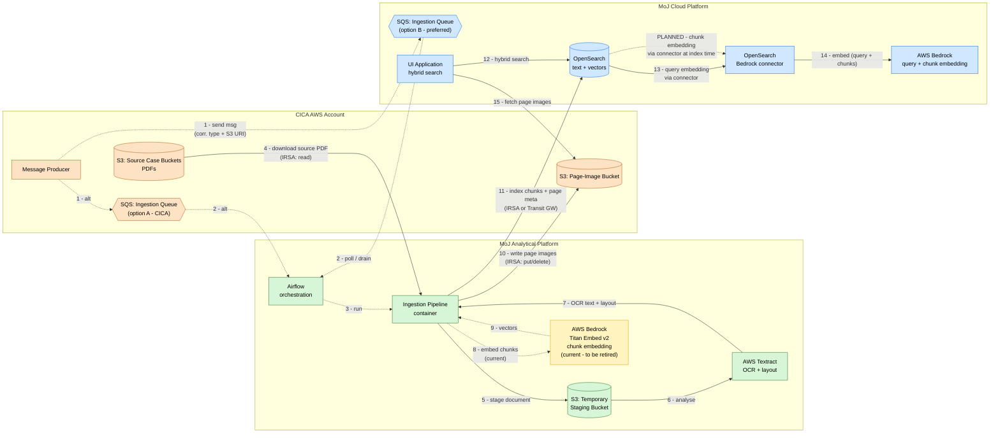
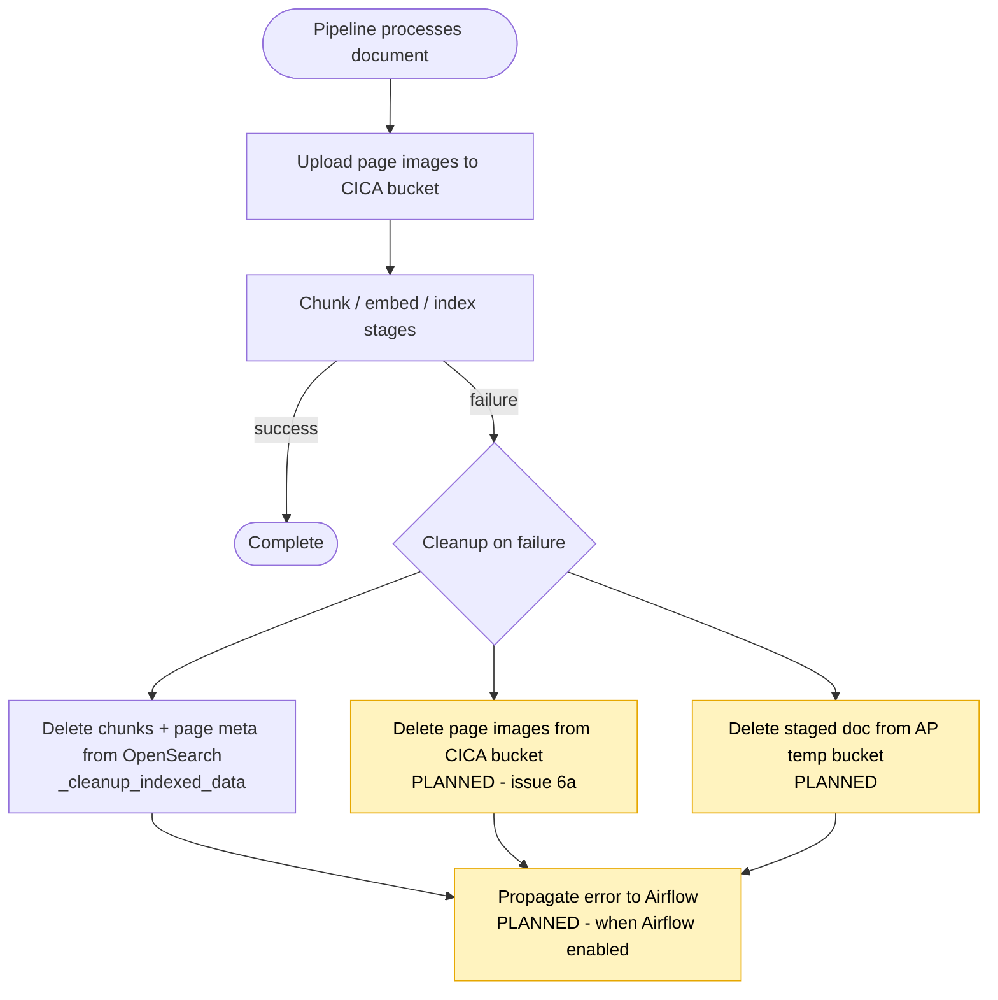

# Infrastructure Architecture & Data Flow

Target infrastructure topology and data flow for the CICA Review Case Documents
system. This reflects the *proposed target design* described in
`infrastructure-review.md`, including items still to be built (SQS trigger,
temporary AP staging bucket, cross-account IRSA). Open decisions are noted on the
diagram.

> Legend: solid arrows = data/document flow; dashed arrows = control/trigger or
> access-scoped calls. Account/platform boundaries are shown as subgraphs.
>
> The topology reads left to right following the lifecycle of the data:
> **CICA AWS Account** (source of case documents) →
> **MoJ Analytical Platform** (ingestion processing) →
> **MoJ Cloud Platform** (data storage + UI). An invisible ordering link
> (`CICA ~~~ AP ~~~ CP`) pins this left-to-right layout so the platforms stay in
> lifecycle order regardless of the cross-boundary edges.

## Target Topology & Data Flow

## Notes on the Diagram

- **Ingestion queue placement (open decision).** Shown as option A (CICA) and
  option B (Cloud Platform, preferred). Messages originate in CICA either way.
  Only one queue will exist in the final design.
- **Temporary staging bucket.** Because AP cannot run Textract cross-account
  against CICA S3, the pipeline stages the source document into an AP-side
  temporary bucket (step 5) and Textract reads from there (step 6). This bucket
  needs a short lifecycle expiry and explicit cleanup on success and failure.
- **Cross-account access via IRSA.** Steps 4, 10, and 11 cross account
  boundaries. The AP workload role must have: `s3:GetObject` on CICA source
  buckets (step 4); `s3:PutObject` **and** `s3:DeleteObject` on the CICA
  page-image bucket (step 10 + failure cleanup); and OpenSearch access (step 11)
  via cross-account IRSA or the MoJO Transit Gateway.
- **Embedding via the OpenSearch Bedrock connector (CP).** Query embedding is
  handled by an OpenSearch Bedrock connector that calls a Bedrock instance on
  Cloud Platform (steps 13-14) — not by the UI directly. **Chunk embedding is
  planned to move to the same connector** (dashed "PLANNED" edge), performed at
  index time on CP. This would retire the AP-side Bedrock embedding step
  (currently steps 8-9, shown amber) and mean the pipeline sends text rather than
  vectors to OpenSearch. Using one connector/model for both query and chunk
  embedding keeps the vectors in a shared space. (Textract does not perform
  embedding.)
- **Data classification.** Case documents (OFFICIAL / OFFICIAL-SENSITIVE) transit
  CICA -> AP temp bucket -> Textract, and extracted text + vectors land in
  OpenSearch on CP. Once chunk embedding moves to the CP connector, chunk text is
  also sent to CP Bedrock at index time. Confirm encryption at rest on the temp
  bucket and CP OpenSearch, and keep Textract in-region and both Bedrock
  instances (AP current, CP connector) in-region (`eu-west-2`).

## Failure / Cleanup Flow

Highlighted (amber) nodes are planned work, not yet implemented:

- **Page-image deletion on failure** (issue 6a in `infrastructure-review.md`):
  currently only OpenSearch data is cleaned up on a late-stage failure; uploaded
  page images are orphaned.
- **Temp staging bucket cleanup**: lifecycle + explicit deletion still to be
  designed.
- **Error propagation to Airflow**: `runner.py` currently exits 0 on failure;
  will re-raise / exit non-zero once Airflow is configured, with a DLQ on the
  ingestion queue.
