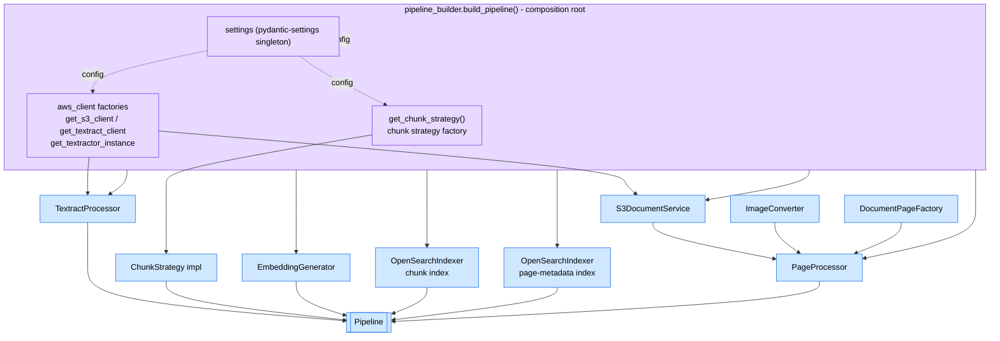
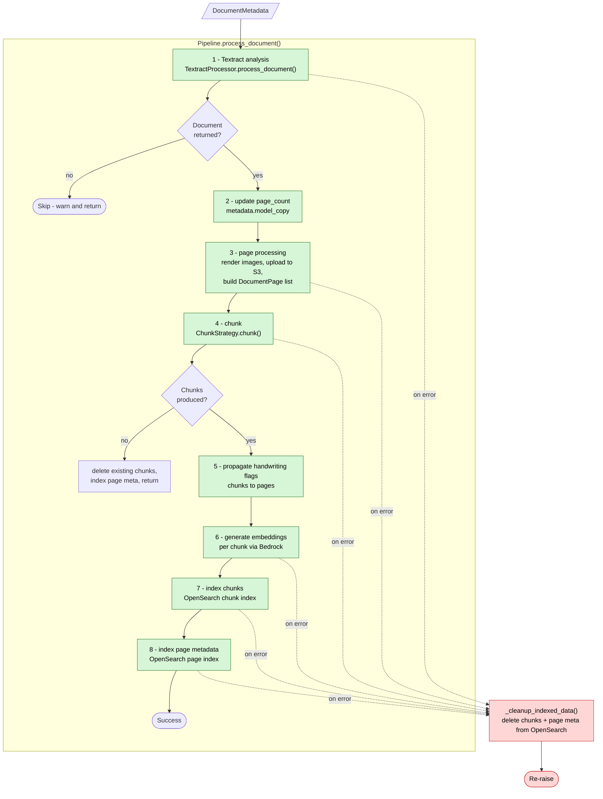
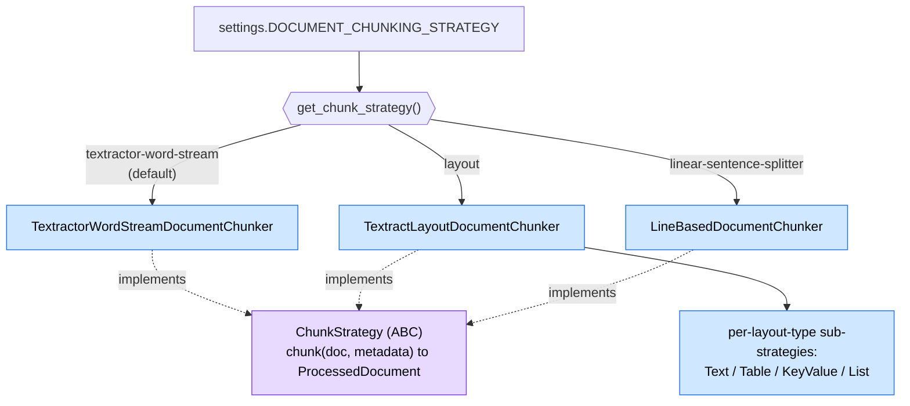
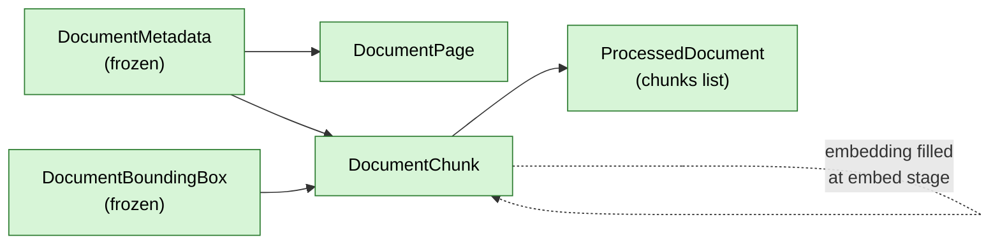

# Ingestion Pipeline Application Architecture

Internal architecture of the ingestion pipeline application code
(`src/ingestion_pipeline/`). This reflects the code as it exists today. See
`architecture-review.md` for the accompanying review and `infrastructure-review.md`
for deployment topology.

## Composition & Dependency Injection

`build_pipeline()` is the composition root: it constructs every component (via
AWS client factories and the chunk-strategy factory) and injects them into the
`Pipeline` orchestrator.

## Per-Document Processing Flow

`Pipeline.process_document(document_metadata)` orchestrates the stages for a
single document.

> Note: on a late-stage failure, `_cleanup_indexed_data()` currently removes only
> OpenSearch data — uploaded page images are not deleted (planned work, issue 6a
> in `infrastructure-review.md`).

## Chunking Strategy Selection

`get_chunk_strategy()` selects one `ChunkStrategy` implementation from
`settings.DOCUMENT_CHUNKING_STRATEGY`. All implement the same ABC and return a
`ProcessedDocument`.

## Core Data Models

Pydantic models passed between stages (defined in `chunking/schemas.py`).

- **DocumentMetadata** (frozen): source doc id, filename, S3 URI, case ref,
  received date, correspondence type, page count (filled after Textract).
- **DocumentPage**: per-page metadata for the page-metadata index (page id, image
  S3 URI, dimensions, handwriting flag).
- **DocumentChunk**: chunk text + bounding box + embedding (filled at the embed
  stage) + case metadata; computed `character_count` / `word_count`.
- **ProcessedDocument**: container holding the list of `DocumentChunk`.
- **DocumentBoundingBox** (frozen): wrapper around the Textractor bounding box.
